# 4.2. Organización del conjunto de datos de estudio a partir de los registros históricos disponibles en el portal operativo

Esta etapa correspondió a la fase de comprensión de los datos de la metodología CRISP-DM. Su finalidad fue reunir las fuentes disponibles, conservar su procedencia y organizar los registros requeridos para la preparación textual, el modelado y la evaluación.

El trabajo comprendió cinco acciones consecutivas: extracción de registros, identificación de atributos, selección de campos textuales, estructuración del conjunto y análisis exploratorio inicial.

## 4.2.1. Extracción de los registros históricos disponibles en ChannelSight

Los registros fueron obtenidos del portal operativo de ChannelSight mediante procedimientos automatizados externos al repositorio analítico. Los archivos recibidos se almacenaron sin modificaciones manuales en `data/raw`, separados de los datos intermedios, procesados y externos.

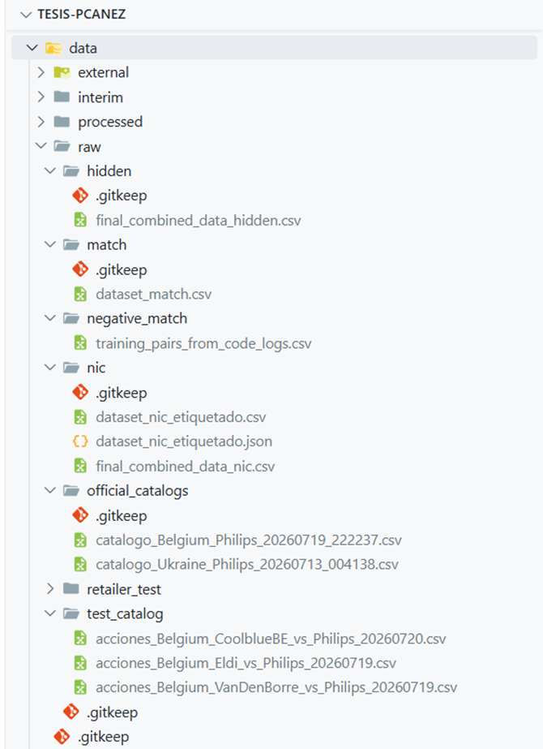

**Figura 85. Estructura de almacenamiento de los datos extraídos**

*Fuente: elaboración propia, 2026.*

Las fuentes fueron organizadas según su procedencia y función, como se presenta en la Tabla 18.

**Tabla 18. Organización de las fuentes de datos extraídas**

| Fuente | Carpeta de origen | Registros | Función dentro del estudio |
|---|---|---:|---|
| Match | `data/raw/match/` | 129.507 | Histórico de correspondencias verificadas. |
| Hidden | `data/raw/hidden/` | 15.355 | Publicaciones excluidas durante la validación. |
| NIC | `data/raw/nic/` | 47.333 | Publicaciones sin correspondencia en el catálogo aplicable. |
| Catálogos oficiales | `data/raw/official_catalogs/` | 14.066 | Productos oficiales disponibles por país. |
| Entradas retailer | `data/raw/retailer_test/` | 384 | Publicaciones utilizadas como entrada del sistema. |
| Pares de códigos | `data/raw/negative_match/` | 896 | Pares etiquetados para verificar variantes técnicas. |
| Acciones de validación | `data/raw/test_catalog/` | 180 | Decisiones humanas utilizadas en la evaluación externa. |

*Fuente: elaboración propia, 2026.*

La Figura 86 muestra el recorrido de las siete fuentes desde su almacenamiento original hasta los componentes que las procesan y utilizan.

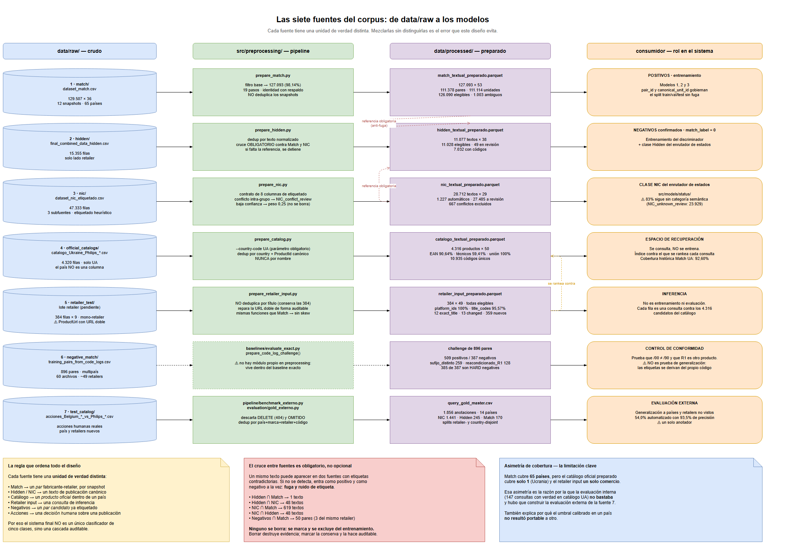

**Figura 86. Flujo de las fuentes del corpus de datos**

*Fuente: elaboración propia, 2026.*

La trazabilidad se mantuvo mediante la ruta y el archivo de origen. En Match también se conservaron `source_year`, `source_month` y `source_file`, debido a que el conjunto correspondió a un histórico de observaciones mensuales.

## 4.2.2. Identificación de los atributos utilizados en la correspondencia de productos

Después de la extracción, se revisaron las 36 columnas de Match para identificar los atributos descriptivos, de identidad, trazabilidad, geografía y calidad. Esta acción se limitó a determinar qué información aportó cada campo; los cálculos exploratorios se presentan posteriormente en la sección 4.2.5.

**Tabla 19. Clasificación funcional de los atributos del conjunto Match**

| Grupo | Atributos principales | Función |
|---|---|---|
| Trazabilidad | `source_year`, `source_month`, `source_file`, `MappingId`, `CreatedDate` | Identificar el origen y periodo del registro. |
| Producto oficial | `ManufacturerProductId`, `ManufacturerProductName`, `ManufacturerProductDescription`, `Brand`, `ExtraInfo` | Describir el producto del fabricante. |
| Publicación retailer | `Retailer`, `RetailerProductId`, `RetailerProductName` | Describir la publicación comercial. |
| Geografía | `ManufacturerProductMappingCountry` | Delimitar el país y el catálogo aplicable. |
| Calidad | `Invalid`, `IsDeleted`, `MatchConfidence`, `LinkIsValid` | Registrar la condición operativa del dato. |

*Fuente: elaboración propia, 2026.*

Los atributos que intervienen en la identidad de cada unidad se presentan en la Tabla 20.

**Tabla 20. Atributos empleados para definir la identidad de los registros**

| Unidad | Atributos de identificación | Función |
|---|---|---|
| Registro histórico | `MappingId`, `source_year`, `source_month`, `source_file` | Distinguir la observación realizada en un periodo. |
| Publicación retailer | `ManufacturerProductMappingCountry`, `Retailer`, `RetailerProductId` | Identificar una publicación dentro de un mercado y comercio. |
| Par fabricante–retailer | `ManufacturerProductMappingCountry`, `ManufacturerProductId`, `Retailer`, `RetailerProductId` | Identificar la relación entre ambos productos. |
| Producto oficial | `ManufacturerProductId` | Identificar el registro del catálogo oficial. |

*Fuente: elaboración propia, 2026.*

Los campos con información utilizable para comparar el producto oficial y la publicación se detallan en la Tabla 21.

**Tabla 21. Atributos relacionados con la correspondencia de productos**

| Atributo | Información aportada |
|---|---|
| `ManufacturerProductId` | Código oficial del producto. |
| `RetailerProductId` | Identificador de la publicación retailer. |
| `ManufacturerProductName` | Nombre canónico del producto oficial. |
| `RetailerProductName` | Título comercial de la publicación. |
| `ManufacturerProductDescription` | Características técnicas y descriptivas. |
| `ExtraInfo` | Códigos EAN, GTIN, CTN, SKU o de modelo. |
| `Brand` | Marca asociada con el producto. |
| `ManufacturerProductMappingCountry` | País empleado para limitar el catálogo de búsqueda. |

*Fuente: elaboración propia, 2026.*

También se comprobó que la denominación de una columna no garantizó el mismo significado entre fuentes. Por ejemplo, `ProductId` identificó el producto oficial en los catálogos, pero pudo representar un identificador interno en las entradas retailer. Por esta razón, cada atributo fue interpretado de acuerdo con su procedencia.

## 4.2.3. Selección de los campos relevantes para el análisis textual

A partir de los atributos identificados se seleccionaron siete campos: cinco para representar el producto oficial y dos para representar la publicación retailer.

**Tabla 22. Campos seleccionados para la representación textual**

| Lado | Campos seleccionados | Propósito |
|---|---|---|
| Fabricante | `Brand`, `ManufacturerProductName`, `ManufacturerProductDescription`, `ManufacturerProductId`, `ExtraInfo` | Integrar nombre, descripción, marca y códigos oficiales. |
| Retailer | `RetailerProductName`, `RetailerProductId` | Representar el título y el identificador de la publicación. |

*Fuente: elaboración propia, 2026.*

Ambos grupos se mantuvieron separados para conservar la relación consulta–candidato requerida por los modelos de recuperación y comparación. Los demás campos continuaron disponibles como metadatos, pero no formaron parte del texto.

**Tabla 23. Campos excluidos de la representación textual**

| Campos | Criterio de exclusión |
|---|---|
| URL e imágenes | No describen textualmente la identidad del producto. |
| `Stock` y `Price` | Son atributos comerciales variables entre periodos. |
| `MappingId` y `CreatedDate` | Cumplen una función de trazabilidad. |
| `Invalid`, `IsDeleted`, `MatchConfidence`, `LinkIsValid` | Corresponden a controles de calidad y no al contenido del producto. |

*Fuente: elaboración propia, 2026.*

La selección quedó centralizada en la configuración del proyecto, con lo cual todas las etapas posteriores emplearon la misma composición de campos.

## 4.2.4. Estructuración del conjunto de datos para su procesamiento

La estructuración comenzó con el filtro `Invalid = false`, `IsDeleted = false` y `MatchConfidence = 100`. De las 129.507 filas originales se conservaron 127.093, equivalentes al 98,14 %. `LinkIsValid` no se utilizó como filtro, porque indicó el estado del enlace y no la validez de la correspondencia histórica.

**Tabla 24. Resultado de la estructuración del conjunto Match**

| Indicador | Resultado |
|---|---:|
| Filas originales | 129.507 |
| Filas descartadas | 2.414 |
| Filas válidas | 127.093 |
| Publicaciones retailer | 110.706 |
| Pares fabricante–retailer | 111.269 |
| Productos oficiales | 17.416 |
| Filas que requirieron llave de respaldo | 465 |
| Unidades canónicas ambiguas | 263 |

*Fuente: elaboración propia, 2026.*

La Figura 87 representa la relación entre los registros históricos, los pares, las publicaciones y los productos oficiales.

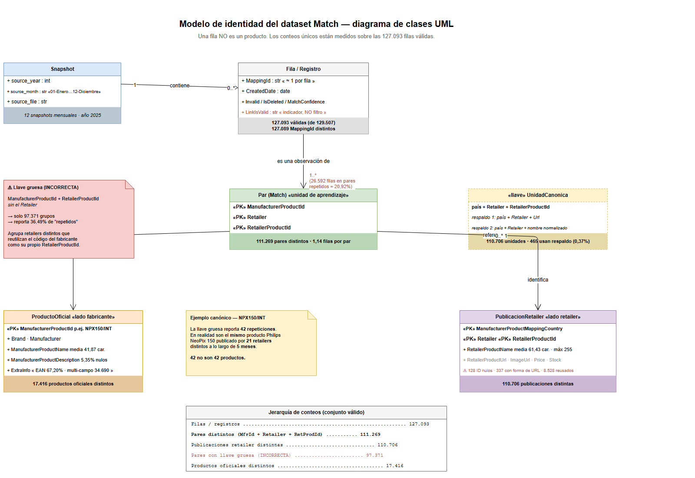

**Figura 87. Modelo de identidad del conjunto histórico Match**

*Fuente: elaboración propia, 2026.*

Para las 465 filas con `RetailerProductId` ausente o malformado se utilizaron como respaldo la URL de la publicación y, en última instancia, el nombre normalizado. Las 263 unidades asociadas con varios productos oficiales fueron marcadas como ambiguas.

El flujo completo de carga, filtrado, definición de identidad y selección de campos se presenta en la Figura 88.

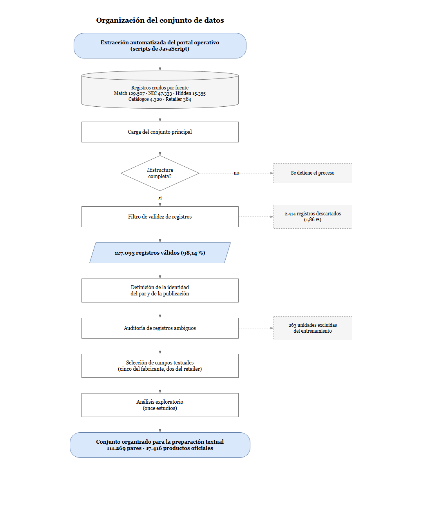

**Figura 88. Flujo de organización del conjunto de datos**

*Fuente: elaboración propia, 2026.*

La repetición entre periodos no fue tratada como duplicación errónea. Se distinguieron los duplicados exactos, las observaciones históricas repetidas y la reutilización de códigos por diferentes comercios, como se muestra en la Figura 89.

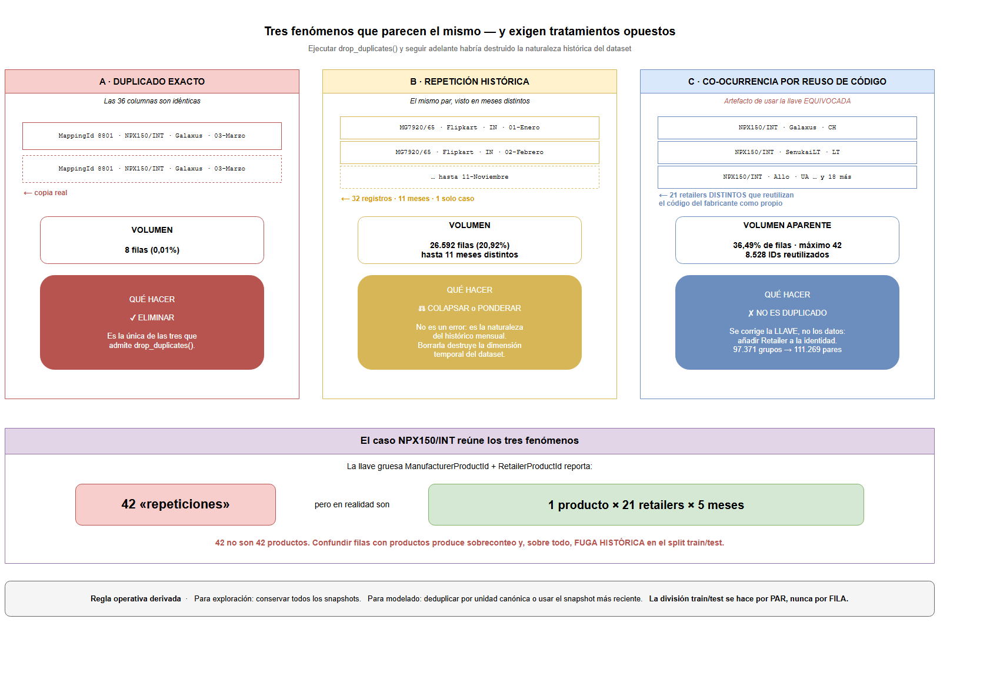

**Figura 89. Diferencia entre duplicación exacta, repetición histórica y reutilización de códigos**

*Fuente: elaboración propia, 2026.*

La lógica de estructuración fue implementada en módulos reutilizables de `src/`, mientras que los cuadernos se emplearon para ejecutar y presentar los resultados. Esta organización se representa en la Figura 90.

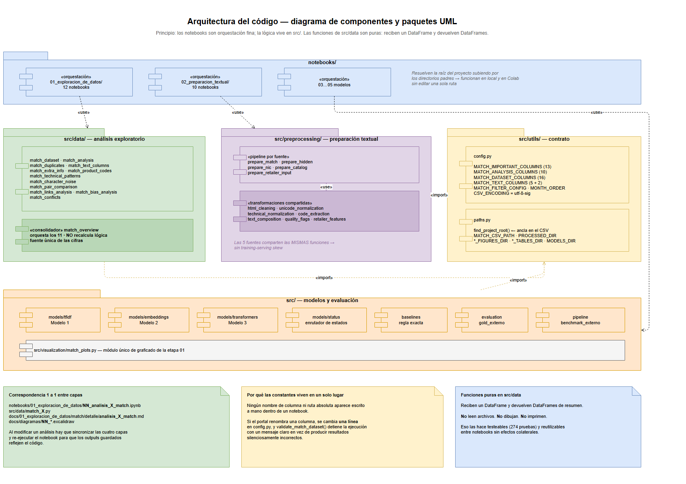

**Figura 90. Arquitectura de los componentes utilizados para organizar los datos**

*Fuente: elaboración propia, 2026.*

## 4.2.5. Análisis exploratorio inicial del conjunto de datos

El análisis exploratorio se ejecutó después de definir la estructura del conjunto. Se desarrollaron once análisis específicos y una consolidación general, según el flujo presentado en la Figura 91.

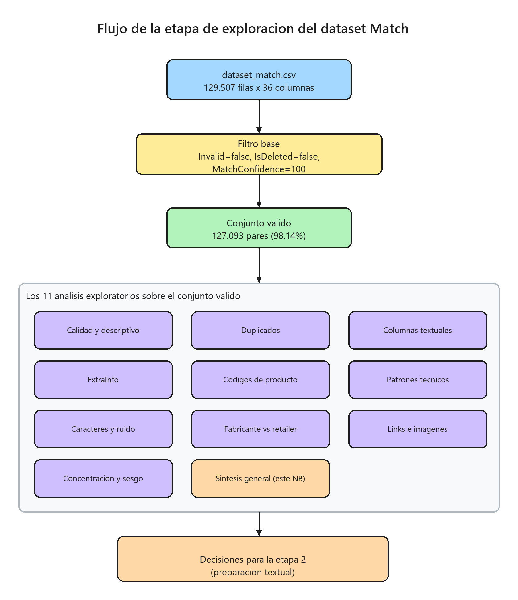

**Figura 91. Flujo del análisis exploratorio del conjunto Match**

*Fuente: elaboración propia, 2026.*

Los resultados principales se resumen en la Tabla 25. Salvo indicación contraria, los porcentajes fueron calculados sobre las 127.093 filas válidas.

**Tabla 25. Resultados principales del análisis exploratorio de Match**

| Análisis | Resultado principal | Representación |
|---|---|---|
| Calidad inicial | 127.093 de 129.507 filas cumplieron el filtro base (98,14 %). | Figura 92 |
| Distribución | 65 países, 636 retailers y 94,52 % de registros de la marca Philips. | Figura 93 |
| Duplicados | 8 duplicados exactos y 26.592 filas con repetición histórica (20,92 %). | Figura 89 |
| Columnas textuales | Longitud media de 41,87 caracteres en el nombre oficial y 61,43 en el título retailer. | Figura 94 |
| `ExtraInfo` | EAN fue el tipo inicial dominante, con 67,20 %. | Figura 95 |
| Códigos de producto | 114.626 títulos retailer presentaron un token con estructura de código (90,19 %). | Figura 96 |
| Patrones técnicos | Pulgadas y vatios fueron los patrones más frecuentes en los títulos retailer. | Figura 97 |
| Caracteres y ruido | El 13,60 % de los nombres oficiales presentó caracteres no latinos. | Figura 98 |
| Fabricante–retailer | El 82,80 % de los títulos retailer incluyó la marca y el 58,97 % el código oficial exacto. | Figura 99 |
| Enlaces e imágenes | El 27,67 % del conjunto completo presentó `LinkIsValid = false`. | Figura 100 |
| Concentración y sesgo | Los diez países principales concentraron 42,03 % y los diez retailers principales 16,27 %. | Figura 101 |

*Fuente: elaboración propia, 2026.*

### 4.2.5.1. Calidad y distribución

El análisis inicial verificó la estructura, los campos obligatorios, los valores nulos y la aplicación del filtro base.

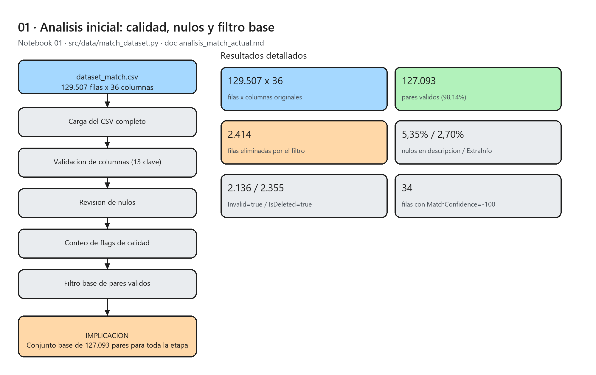

**Figura 92. Carga, validación y calidad inicial del conjunto Match**

*Fuente: elaboración propia, 2026.*

La distribución permitió identificar el alcance geográfico y comercial, así como la concentración de registros en la marca Philips.

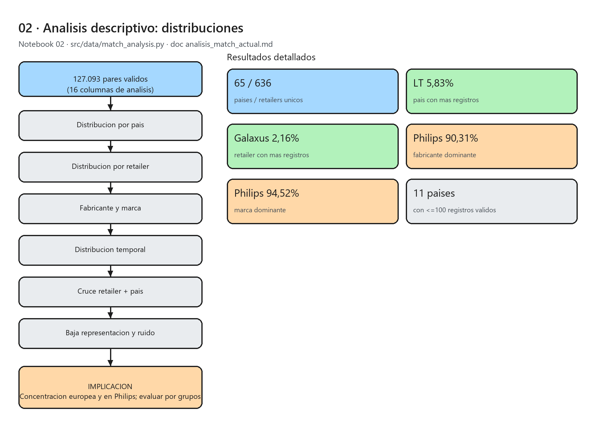

**Figura 93. Distribución del conjunto Match por marca, país y retailer**

*Fuente: elaboración propia, 2026.*

### 4.2.5.2. Texto, códigos y atributos técnicos

El perfil textual evidenció diferencias de longitud y contenido entre la información oficial y los títulos comerciales.

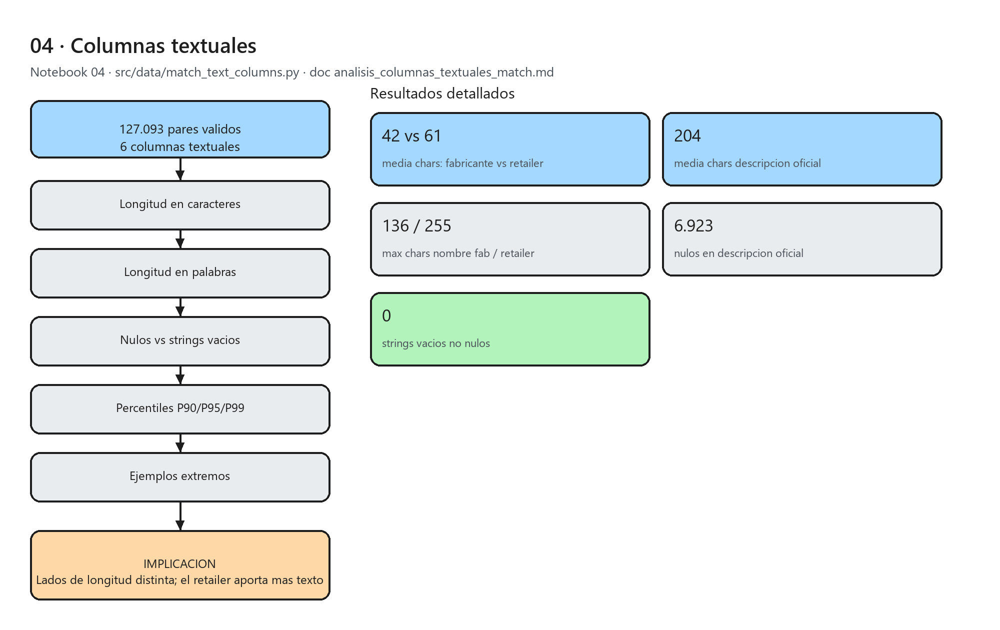

**Figura 94. Caracterización de las columnas textuales de Match**

*Fuente: elaboración propia, 2026.*

El análisis de `ExtraInfo` permitió reconocer los tipos de códigos oficiales disponibles.

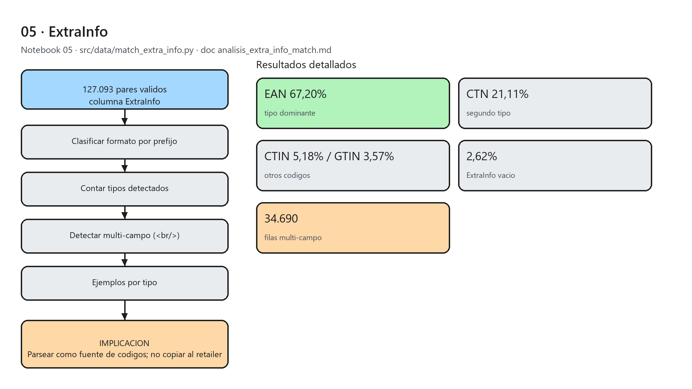

**Figura 95. Tipos de información identificados en ExtraInfo**

*Fuente: elaboración propia, 2026.*

La proporción de 90,19 % se obtuvo en el análisis de códigos mediante la relación `114.626 / 127.093 × 100`, como se presenta en la Figura 96.

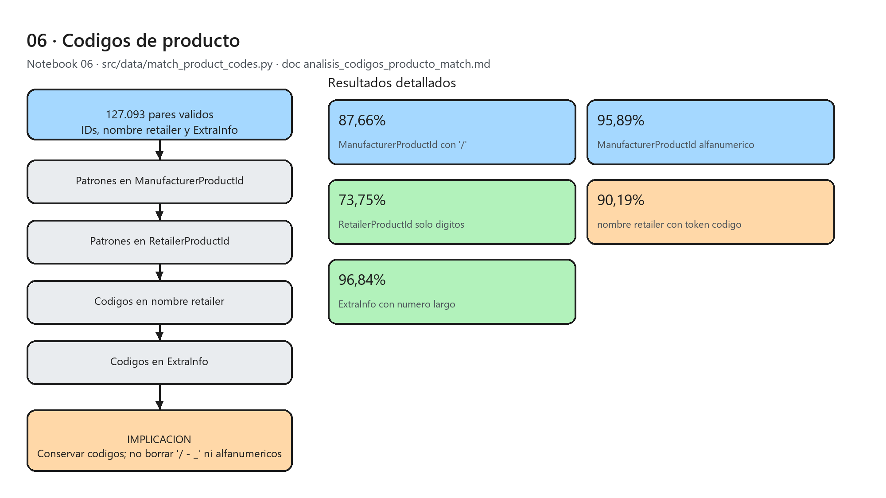

**Figura 96. Patrones de códigos identificados en los productos**

*Fuente: elaboración propia, 2026.*

El análisis de patrones técnicos identificó unidades y especificaciones que debían conservarse durante la normalización.

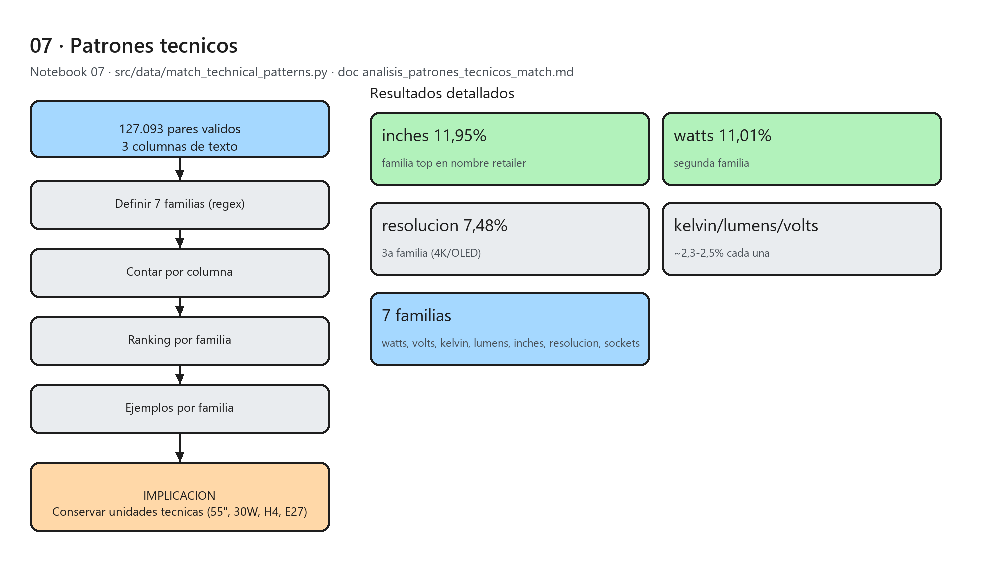

**Figura 97. Patrones técnicos identificados en los campos textuales**

*Fuente: elaboración propia, 2026.*

### 4.2.5.3. Ruido, diferencias textuales y sesgo

La revisión de caracteres mostró que barras, guiones, comillas y alfabetos no latinos formaron parte de la información del producto y no debían eliminarse de manera indiscriminada.

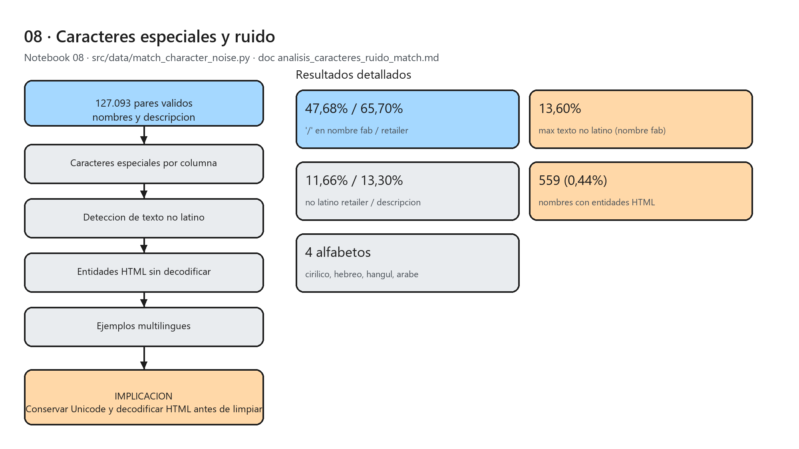

**Figura 98. Caracteres, símbolos y texto no latino identificados**

*Fuente: elaboración propia, 2026.*

La comparación entre ambos lados del par mostró que el título retailer integró señales que en el catálogo aparecieron distribuidas entre varios campos.

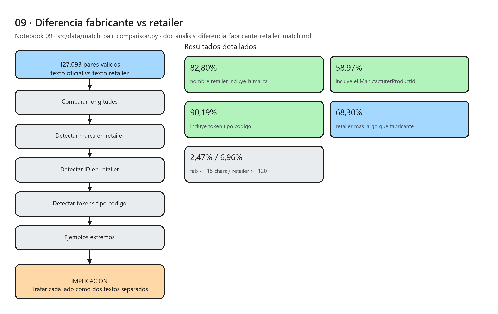

**Figura 99. Diferencias entre el texto del fabricante y del retailer**

*Fuente: elaboración propia, 2026.*

La revisión de enlaces confirmó que su disponibilidad no debía utilizarse para descartar una correspondencia histórica.

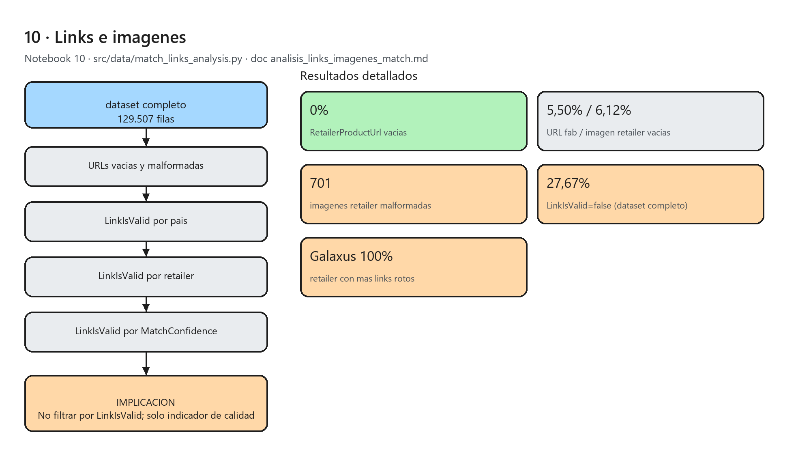

**Figura 100. Estado de los enlaces e imágenes del conjunto Match**

*Fuente: elaboración propia, 2026.*

Finalmente, el análisis de concentración permitió reconocer el predominio de Philips y la necesidad de evaluar los modelos por país, retailer y marca.

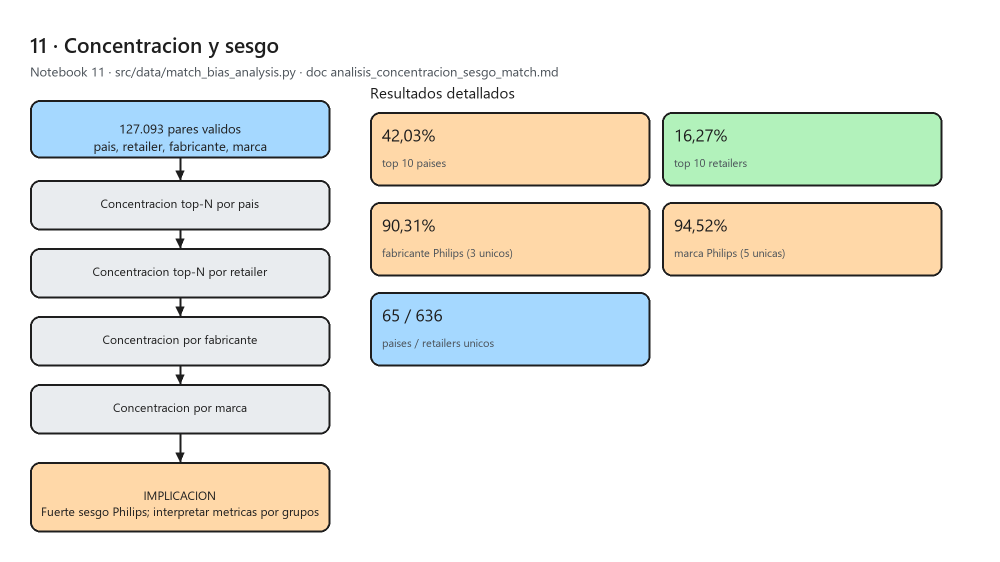

**Figura 101. Concentración y sesgo del conjunto Match**

*Fuente: elaboración propia, 2026.*

El análisis exploratorio también se extendió a las demás fuentes crudas, cuyos resultados principales se presentan en la Tabla 26.

**Tabla 26. Resultados exploratorios de las fuentes complementarias**

| Fuente | Resultado principal |
|---|---|
| Hidden | 15.355 filas y 11.077 textos únicos después de la normalización. |
| NIC | 47.333 filas y 28.712 textos normalizados no vacíos. |
| Catálogos oficiales | 9.746 productos de Bélgica y 4.320 de Ucrania; 3.157 identificadores compartidos. |
| Entradas retailer | 384 publicaciones, de las cuales 359 no aparecieron en el histórico Match. |
| Pares de códigos | 896 pares sin valores nulos ni duplicados exactos. |
| Acciones de validación | 178 de las 180 decisiones iniciales resultaron evaluables. |

*Fuente: elaboración propia, 2026.*

En conjunto, los resultados justificaron conservar códigos, números, símbolos técnicos y caracteres Unicode durante la preparación textual. También establecieron la necesidad de controlar la repetición histórica y evaluar el desempeño por grupos antes de comparar los modelos.
