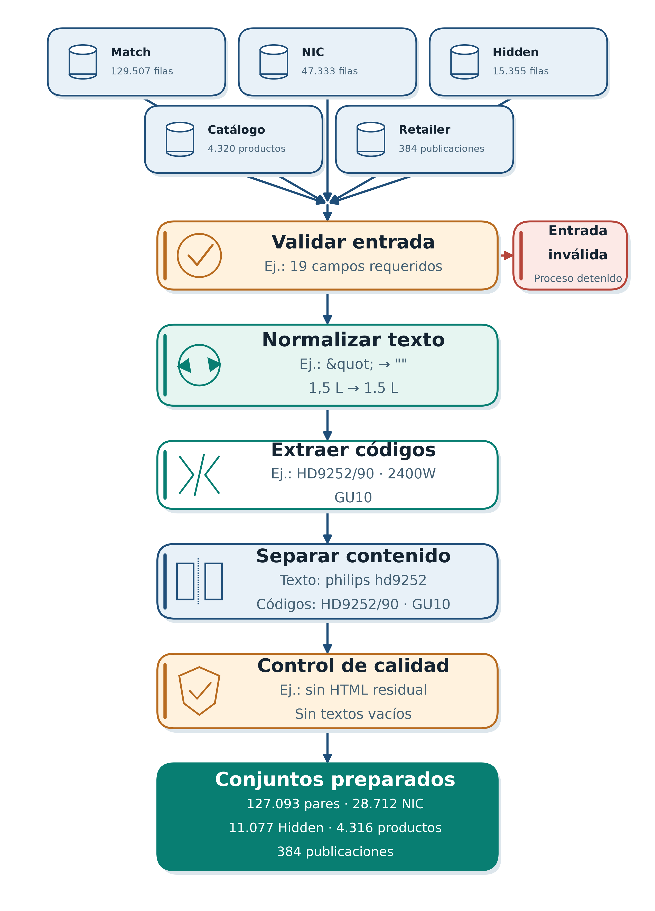
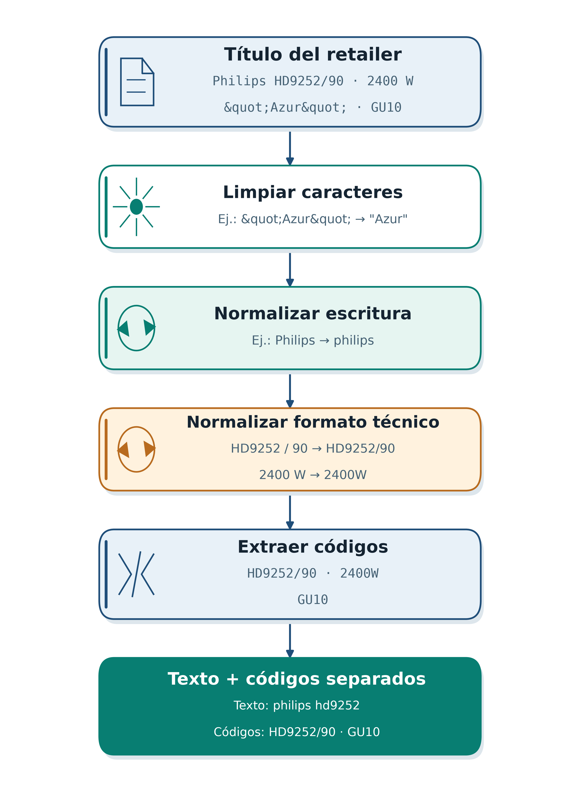
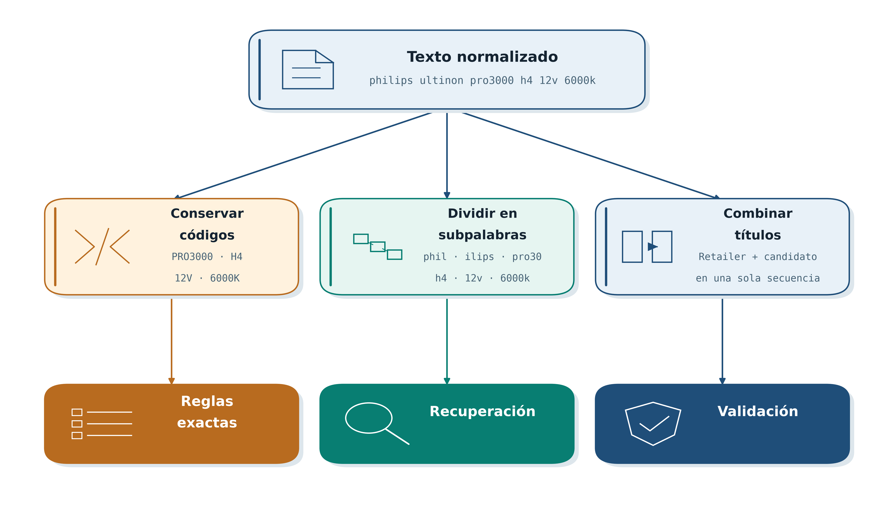
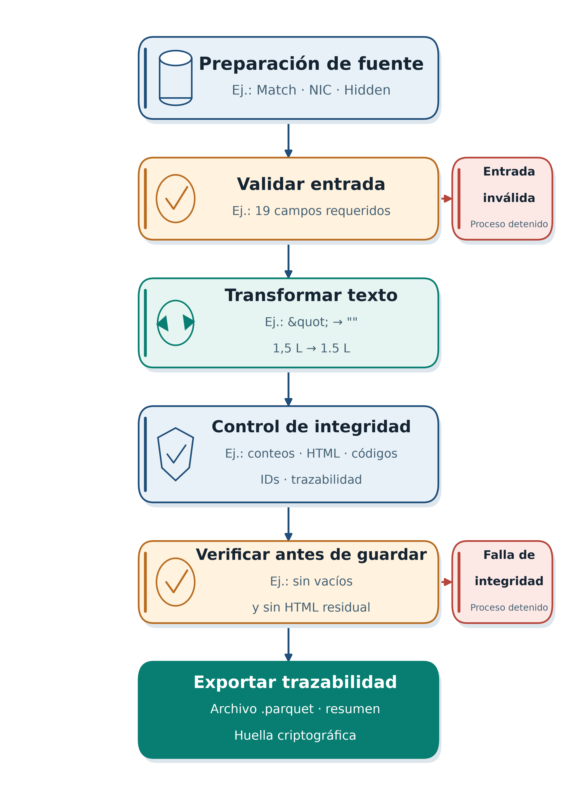

# 4.3. DEFINICIÓN DEL PIPELINE DE PROCESAMIENTO TEXTUAL PARA LA PREPARACIÓN DE LOS DATOS UTILIZADOS EN LA CORRESPONDENCIA DE PRODUCTOS

En esta sección se definió el *pipeline* de preparación textual aplicado a Match, Hidden, NIC, catálogos oficiales y publicaciones de *retailers*. La extracción desde ChannelSight fue descrita en el apartado 4.2.1; por ello, esta fase de CRISP-DM comenzó con los archivos crudos y comprendió su limpieza, normalización, extracción de códigos, control de calidad y exportación, sin modificar las fuentes originales ni entrenar modelos. La secuencia general se presenta en la Figura 102.

**Figura 102. Pipeline de procesamiento textual aplicado a las fuentes de datos**

*Fuente: elaboración propia, 2026.*

## 4.3.1. Limpieza de caracteres irrelevantes en los títulos de productos

Los valores nulos se convirtieron de forma segura a cadenas. El texto del fabricante se construyó con la marca, el nombre y la descripción, mientras que el texto del *retailer* utilizó el título publicado. Los identificadores, el país, el *retailer* y las URL permanecieron como metadatos. La limpieza se realizó de forma conservadora para no eliminar información técnica o multilingüe.

**Tabla 27. Criterios de limpieza del texto de productos**

| Elemento | Tratamiento | Finalidad |
|---|---|---|
| Entidades HTML y espacios no separables | Decodificación de hasta tres pasadas | Recuperar caracteres y espacios convencionales. |
| Caracteres de control invisibles | Eliminación según la categoría Unicode | Evitar diferencias no visibles entre cadenas. |
| Separadores y puntuación no admitida | Sustitución por espacios | Reducir ruido sin unir términos. |
| `/`, `-`, `"`, `.`, `+`, `%` y dígitos | Conservación | Mantener códigos, variantes y magnitudes. |
| Alfabetos no latinos | Conservación | Preservar la información multilingüe. |

*Fuente: elaboración propia, 2026.*

No se aplicaron procesos de eliminación de números, transliteración a ASCII, lematización ni supresión de palabras vacías. Los textos originales también se conservaron para auditar la transformación.

## 4.3.2. Normalización de los textos para estandarizar la información

La normalización combinó Unicode NFKC, plegado de caso mediante `casefold()`, compactación de espacios y reglas técnicas del dominio. Las principales transformaciones se presentan en la Tabla 28.

**Tabla 28. Reglas de normalización textual y técnica**

| Regla | Entrada | Resultado |
|---|---|---|
| Compatibilidad Unicode | `Ｐｈｉｌｉｐｓ` | `philips` |
| Guiones y comillas | `LED—55″` | `led-55"` |
| Signo de multiplicación | `55×40 cm` | `55x40 cm` |
| Coma decimal | `1,5 L` | `1.5 l` |
| Valor y unidad | `12 V`, `4000 K` | `12v`, `4000k` |
| Base de lámpara | `GU 10`, `E 27` | `gu10`, `e27` |
| Espacios alrededor de `/` | `HD9252 / 90` | `hd9252/90` |
| Separadores y agrupadores | `LED | (blanco)` | `led blanco` |

*Fuente: elaboración propia, 2026.*

Las reglas se ejecutaron hasta alcanzar un resultado estable, con un máximo de tres iteraciones. La Figura 103 muestra una transformación representativa y la separación posterior de los códigos.

**Figura 103. Transformación de un título de producto**

*Fuente: elaboración propia, 2026.*

## 4.3.3. Tokenización de los títulos de productos

El *pipeline* entregó textos normalizados y utilizó una segmentación acorde con cada componente. Los n-gramas y las subpalabras se generaron posteriormente en los modelos; no se almacenaron como columnas permanentes del conjunto preparado.

**Tabla 29. Mecanismos de tokenización utilizados en el sistema**

| Mecanismo | Aplicación |
|---|---|
| Expresión regular que conserva `/`, `-`, `+` y `.` | Extracción y canonización de códigos. |
| N-gramas de caracteres `char_wb` de 4 a 6 caracteres | Recuperación de candidatos mediante TF-IDF. |
| Subpalabras con separación entre las dos secuencias | Validación posterior de pares mediante Transformer. |
| Separación por espacios | Conteo de términos y control del texto preparado. |

*Fuente: elaboración propia, 2026.*

Un token se consideró código cuando combinó letras y dígitos o representó una unidad técnica reconocida. Los códigos se almacenaron separados del texto descriptivo. La Figura 104 resume las tres segmentaciones funcionales.

**Figura 104. Formas de tokenización según su función en el sistema**

*Fuente: elaboración propia, 2026.*

## 4.3.4. Flujo de preparación textual previo al análisis

El flujo se documentó mediante 19 actividades y 13 transformaciones aplicadas a una fila representativa. Para su presentación se sintetizó en las cinco fases de la Tabla 30.

**Tabla 30. Fases del flujo de preparación textual**

| Fase | Actividades principales | Resultado |
|---|---|---|
| Contrato y filtrado | Verificación de columnas y, en Match, aplicación de `Invalid = false`, `IsDeleted = false` y `MatchConfidence = 100` | Entrada válida por fuente. |
| Identidad y consolidación | Generación de identificadores; control de repetición, duplicados y conflictos | Registros trazables. |
| Transformación textual | Limpieza, normalización, composición y extracción de códigos | Texto y códigos separados. |
| Calidad y elegibilidad | Cálculo de métricas y banderas | Uso directo o revisión. |
| Validación y exportación | Verificación de invariantes; generación de Parquet, tablas, manifiesto y huellas SHA-256 | Artefactos reproducibles. |

*Fuente: elaboración propia, 2026.*

En Match, `LinkIsValid` se conservó como metadato y no se utilizó como filtro. La validación se ejecutó al finalizar el procesamiento y antes de guardar el resultado; cualquier inconsistencia detuvo la exportación. Este control se representa en la Figura 105.

**Figura 105. Ejecución del pipeline con verificación de integridad**

*Fuente: elaboración propia, 2026.*

Los resultados de la versión 1.3.1 del *pipeline* para Match se presentan en la Tabla 31.

**Tabla 31. Resultados de validación de la preparación textual de Match**

| Indicador | Resultado |
|---|---:|
| Registros originales / válidos / descartados | 129.507 / 127.093 / 2.414 |
| Salida preparada | 127.093 filas y 53 columnas |
| Textos vacíos, fabricante / *retailer* | 0 / 0 |
| Entidades HTML, antes / después | 575 / 0 |
| Filas no latinas, antes / después | 30.919 / 30.919 |
| Textos con idempotencia verificada | 254.186 |
| Cobertura de códigos: fabricante / título *retailer* / combinación *retailer* | 100,0000 % / 90,5337 % / 99,9811 % |
| Calidad | 91.560 `strong`; 34.530 `usable`; 1.003 `ambiguous` |
| Elegibilidad | 126.090 `eligible`; 1.003 `review`; 0 `exclude` |
| Estado de validación | Aprobado |

*Fuente: elaboración propia, 2026.*

La diferencia entre las entradas y salidas complementarias respondió a filtros o consolidaciones documentadas, como se resume en la Tabla 32.

**Tabla 32. Resultados de preparación por fuente de datos**

| Fuente | Entrada | Salida | Control principal |
|---|---:|---:|---|
| Match | 129.507 | 127.093 pares | 2.414 registros descartados por el filtro; 0 pérdidas posteriores. |
| Hidden | 15.355 | 11.077 textos | 82 casos con HTML reducidos a 0; 406 filas no latinas preservadas. |
| NIC | 47.333 | 28.712 registros | 18.613 filas consolidadas, 8 textos vacíos excluidos y 667 conflictos marcados para revisión. |
| Catálogo de Ucrania | 4.320 | 4.316 productos | 4 filas consolidadas; 0 textos vacíos y 987 productos no latinos preservados. |
| Publicaciones de *retailers* | 384 | 384 publicaciones | Conservación de cada consulta y paridad con el contrato de inferencia. |

*Fuente: elaboración propia, 2026.*

Los archivos preparados se destinaron a `data/processed`, y los resúmenes y manifiestos se almacenaron en `reports/02_preparacion_textual/tables`. En consecuencia, la fase produjo entradas textuales reproducibles y trazables para las etapas posteriores de representación y modelado.
