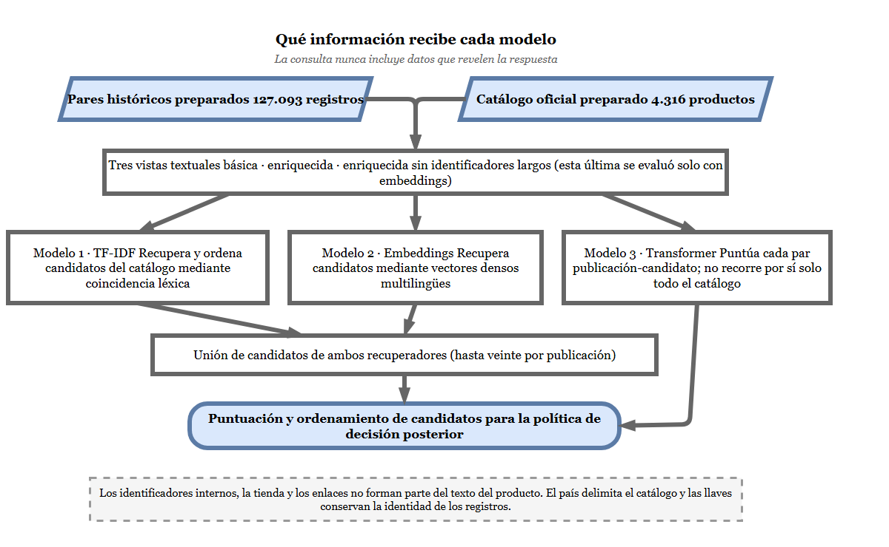
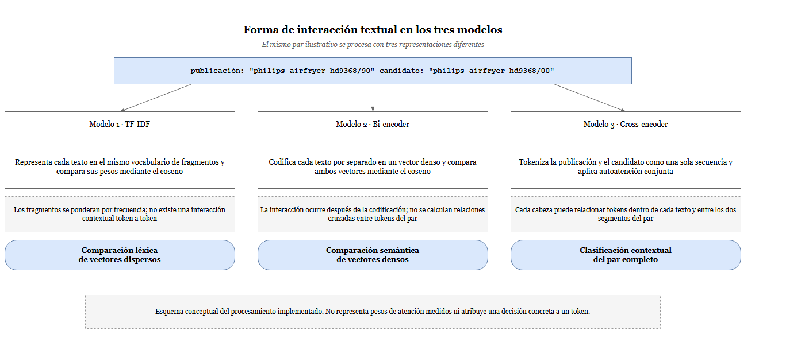
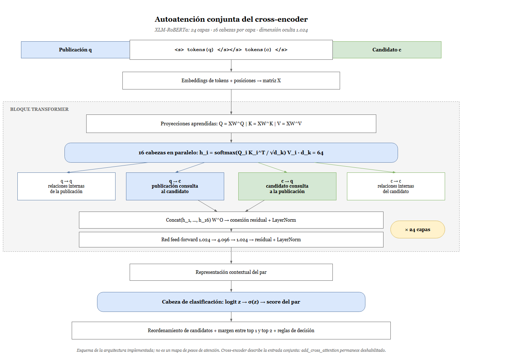
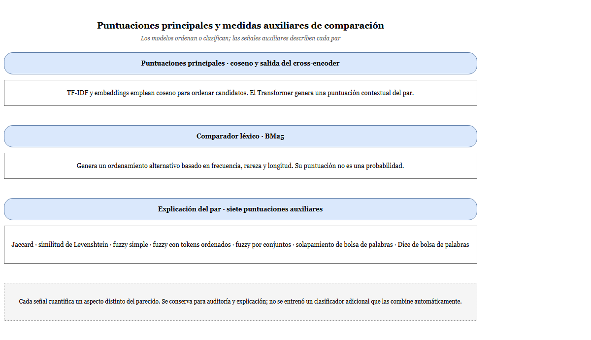
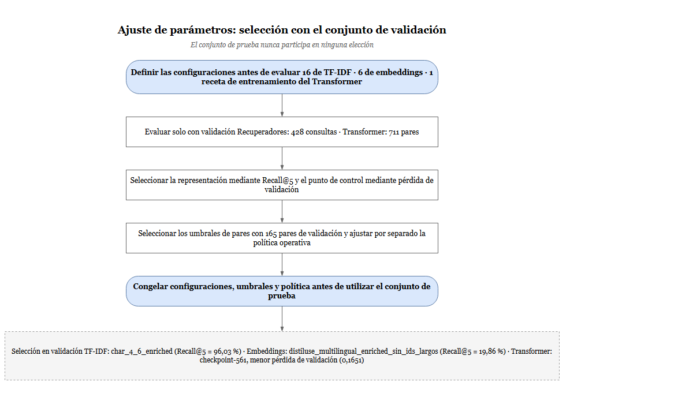
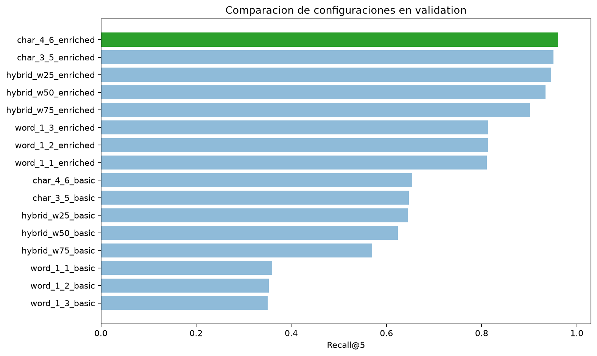
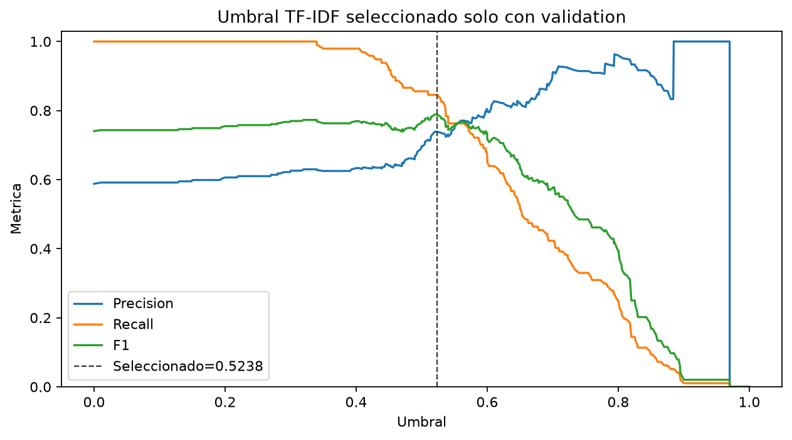
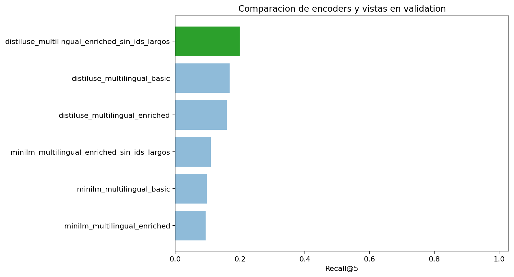
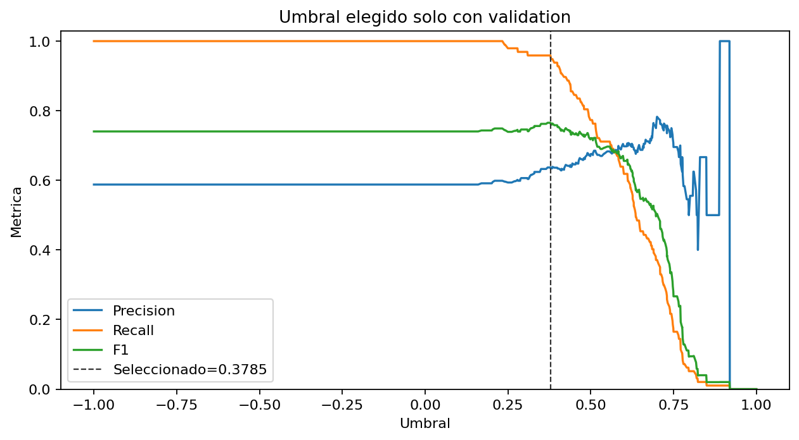
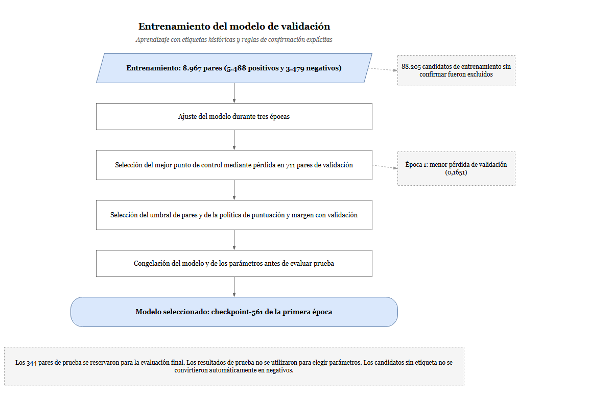

# 4.4. DISEÑO DE LOS MODELOS ALGORÍTMICOS DE CORRESPONDENCIA DE PRODUCTOS MEDIANTE TÉCNICAS DE ANÁLISIS TEXTUAL

En esta etapa se desarrollaron tres enfoques para comparar publicaciones de comercios minoristas con productos del catálogo oficial: un modelo léxico basado en TF-IDF, un modelo de representaciones vectoriales multilingües y un Transformer para la clasificación contextual de pares. El desarrollo comprendió la selección de representaciones textuales, la implementación de los modelos, el cálculo de puntuaciones y el ajuste de sus configuraciones mediante el conjunto de validación.

Se diferenciaron dos tareas. La primera consistió en recuperar un conjunto reducido de productos candidatos desde el catálogo; la segunda, en determinar si una publicación y un candidato representaban el mismo producto. Esta separación fue necesaria porque una puntuación alta de similitud no constituyó, por sí sola, una correspondencia confirmada. En consecuencia, los Modelos 1 y 2 se utilizaron como recuperadores, mientras que el Modelo 3 se empleó como validador y reordenador de pares.

## 4.4.1. Selección de métodos de representación textual

### a) Representaciones seleccionadas y función de los modelos

La selección consideró la presencia de nombres comerciales, variaciones lingüísticas, abreviaciones, códigos de modelo y sufijos técnicos. Se implementaron representaciones capaces de conservar coincidencias léxicas, aproximar relaciones semánticas y analizar conjuntamente los dos textos. La Tabla 33 resume los métodos seleccionados.

**Tabla 33. Representaciones y funciones de los modelos implementados**

| Modelo | Representación | Forma de comparación | Función principal |
|---|---|---|---|
| Modelo 1: TF-IDF | Vectores dispersos de palabras y fragmentos de caracteres. | Similitud del coseno en un vocabulario ajustado con el catálogo. | Recuperar y ordenar candidatos mediante señal léxica. |
| Modelo 2: *embeddings* | Vectores densos multilingües de 384 o 512 componentes. | Codificación independiente de cada texto y similitud del coseno. | Explorar recuperación semántica y aportar candidatos complementarios. |
| Modelo 3: Transformer | Representación contextual de la publicación y el candidato en una secuencia conjunta. | Clasificación binaria mediante un *cross-encoder*. | Puntuar pares y reordenar los candidatos recuperados. |

*Fuente: elaboración propia, 2026.*

El Modelo 1 conservó la señal de palabras, códigos y sufijos mediante n-gramas. El Modelo 2 permitió representar textos de distintos idiomas en un espacio vectorial común. El Modelo 3 incorporó aprendizaje supervisado sobre pares para que la publicación y el candidato intervinieran conjuntamente en el cálculo de la puntuación.

Como referencia previa al Modelo 1 se mantuvo un procedimiento determinista de correspondencia exacta. También se implementó BM25 como comparador léxico. Estos componentes no constituyeron modelos neuronales: las reglas exactas actuaron como una primera capa conservadora y BM25 se utilizó como referencia de recuperación y explicación.

### b) Construcción de las vistas textuales

Los modelos utilizaron los campos preparados en el objetivo anterior. Se construyeron tres vistas para estudiar el efecto de incorporar descripciones y códigos técnicos sin modificar los registros originales. Su composición se presenta en la Tabla 34.

**Tabla 34. Vistas textuales utilizadas por los modelos**

| Vista | Texto de la publicación | Texto del producto oficial | Aplicación |
|---|---|---|---|
| Básica | Texto normalizado del título retailer. | Marca y nombre del producto; en el catálogo se utilizó el texto preparado como respaldo cuando esos campos no estuvieron disponibles. | Modelos 1 y 2. |
| Enriquecida | Texto normalizado y códigos extraídos del propio título. | Texto preparado del fabricante o catálogo, códigos de producto, EAN y códigos técnicos disponibles. | Modelos 1, 2 y 3. |
| Enriquecida sin identificadores largos | Vista enriquecida con exclusión selectiva de tokens identificados como códigos largos. | La misma exclusión sobre el texto del candidato. | Variante experimental del Modelo 2. |

*Fuente: elaboración propia, 2026.*

En la tercera vista se excluyeron tokens numéricos compactos de ocho o más caracteres y tokens alfanuméricos de al menos dieciséis caracteres con seis o más dígitos. Se conservaron referencias cortas como `DST6120/20` y unidades como `2600w`. Si la exclusión dejaba un texto vacío, se mantuvo su versión normalizada. Por tanto, esta variante no eliminó todos los códigos del producto.

Los identificadores internos de la plataforma, los enlaces y los atributos de procedencia no se incorporaron como contenido descriptivo. El país se conservó para delimitar el catálogo, y las llaves de identidad se utilizaron para organizar los registros. El código del producto correcto no se añadió a la consulta a partir de la correspondencia histórica: los códigos de la publicación procedieron exclusivamente de su propio título.

La Figura 106 sintetiza la relación entre las fuentes preparadas, las representaciones y la función asignada a cada modelo.

**Figura 106. Información utilizada y función de los modelos de correspondencia**

*Fuente: elaboración propia, 2026.*

### c) Formas de interacción entre los textos

Los tres modelos no observaron el par de la misma manera. En TF-IDF, los textos se transformaron por separado dentro de un vocabulario común y se compararon sus pesos. En el modelo de *embeddings*, cada texto se condensó de forma independiente en un vector denso y la interacción ocurrió únicamente al calcular el coseno. En el *cross-encoder*, en cambio, los tokens de ambos textos ingresaron en una misma secuencia y participaron en la autoatención conjunta.

La Figura 107 presenta esta diferencia mediante un mismo par ilustrativo. El esquema describe el procesamiento implementado; no representa pesos de atención medidos ni demuestra que un token específico haya causado una predicción.

**Figura 107. Formas de interacción textual utilizadas por los tres modelos**

*Fuente: elaboración propia, 2026.*

### d) Métricas definidas para el desarrollo

La recuperación y la clasificación de pares se evaluaron con métricas diferentes. Las métricas de *ranking* midieron si el producto correcto apareció dentro de los primeros candidatos; las métricas binarias midieron el comportamiento de un umbral sobre pares positivos y negativos confirmados. La Tabla 35 presenta su función.

**Tabla 35. Métricas utilizadas durante el diseño y el ajuste**

| Métrica | Unidad de análisis | Interpretación |
|---|---|---|
| Recall@k | Consulta contra catálogo. | Proporción de consultas cuyo producto correcto apareció entre los primeros (k) candidatos. |
| MRR | Consulta contra catálogo. | Promedio del inverso de la posición del primer candidato correcto. |
| *Accuracy* | Par etiquetado. | Proporción total de pares clasificados correctamente. |
| Precisión | Par etiquetado o decisión automatizada. | Proporción de predicciones positivas que fueron correctas. |
| *Recall* | Par positivo. | Proporción de positivos confirmados recuperados por el umbral. |
| F1 | Par etiquetado. | Media armónica entre precisión y *recall*. |
| Tasa de falsos positivos | Par negativo. | Proporción de negativos confirmados aceptados incorrectamente como positivos. |
| Cobertura | Consulta. | Proporción de consultas para las que una política emitió una decisión automatizada. |
| Abstención | Consulta. | Proporción de consultas remitidas a revisión humana. |

*Fuente: elaboración propia, 2026.*

Para $Q$ consultas, el Recall@k se calculó mediante la siguiente expresión:

**Ecuación 11: Ecuación del Recall@k**

$$
\operatorname{Recall@k}=\frac{1}{Q}\sum_{i=1}^{Q}\mathbb{I}(r_i\leq k)
$$

*Fuente: elaboración propia, 2026.*

Como se observa en la Ecuación 11, la métrica representa la proporción de consultas cuyo producto correcto apareció entre las primeras $k$ posiciones. Donde $Q$ es el número de consultas, $r_i$ es la posición del primer producto correcto y $\mathbb{I}$ es la función indicadora.

La posición promedio del primer resultado correcto se resumió mediante el rango recíproco medio.

**Ecuación 12: Ecuación del rango recíproco medio**

$$
\operatorname{MRR}=\frac{1}{Q}\sum_{i=1}^{Q}\frac{1}{r_i}
$$

*Fuente: elaboración propia, 2026.*

Como se observa en la Ecuación 12, el MRR asigna mayor valor a los aciertos ubicados en las primeras posiciones. Cuando el producto correcto no apareció en la lista recuperada, su contribución fue igual a cero.

La exactitud cuantificó la proporción total de pares clasificados correctamente.

**Ecuación 13: Ecuación de la exactitud**

$$
\operatorname{Exactitud}=\frac{TP+TN}{TP+TN+FP+FN}
$$

*Fuente: elaboración propia, 2026.*

Como se observa en la Ecuación 13, la exactitud relaciona los verdaderos positivos y verdaderos negativos con el total de pares evaluados. Donde $TP$, $TN$, $FP$ y $FN$ representan verdaderos positivos, verdaderos negativos, falsos positivos y falsos negativos, respectivamente.

La precisión evaluó la confiabilidad de los pares aceptados como correspondencias.

**Ecuación 14: Ecuación de la precisión**

$$
\operatorname{Precisión}=\frac{TP}{TP+FP}
$$

*Fuente: elaboración propia, 2026.*

Como se observa en la Ecuación 14, la precisión divide los verdaderos positivos entre todas las predicciones positivas.

El *recall* o sensibilidad midió la recuperación de las correspondencias positivas reales.

**Ecuación 15: Ecuación del recall o sensibilidad**

$$
\operatorname{Recall}=\frac{TP}{TP+FN}
$$

*Fuente: elaboración propia, 2026.*

Como se observa en la Ecuación 15, el *recall* divide los verdaderos positivos entre la totalidad de correspondencias positivas reales.

El F1-score integró precisión y *recall* mediante su media armónica.

**Ecuación 16: Ecuación del F1-score**

$$
F1=2\frac{\operatorname{Precisión}\cdot\operatorname{Recall}}
{\operatorname{Precisión}+\operatorname{Recall}}
$$

*Fuente: elaboración propia, 2026.*

Como se observa en la Ecuación 16, el F1-score penaliza desequilibrios entre precisión y *recall* y permite resumir ambas métricas en un solo valor.

La tasa de falsos positivos cuantificó el riesgo de aceptar pares que correspondían a productos distintos.

**Ecuación 17: Ecuación de la tasa de falsos positivos**

$$
\operatorname{FPR}=\frac{FP}{FP+TN}
$$

*Fuente: elaboración propia, 2026.*

Como se observa en la Ecuación 17, la FPR relaciona los falsos positivos con todos los pares negativos reales.

Para la política operativa se calcularon por separado la cobertura y la abstención.

**Ecuación 18: Ecuación de la cobertura automatizada**

$$
\operatorname{Cobertura}=\frac{Q_{\mathrm{automáticas}}}{Q}
$$

*Fuente: elaboración propia, 2026.*

Como se observa en la Ecuación 18, la cobertura representa la proporción de consultas que recibieron una decisión automática.

**Ecuación 19: Ecuación de la abstención**

$$
\operatorname{Abstención}=1-\operatorname{Cobertura}
$$

*Fuente: elaboración propia, 2026.*

Como se observa en la Ecuación 19, la abstención corresponde a la proporción complementaria remitida a revisión humana. Esta distinción evitó seleccionar un modelo únicamente por exactitud global cuando el objetivo operativo exigió controlar los falsos positivos.

## 4.4.2. Implementación de modelos de correspondencia de productos

### a) Organización experimental común

La implementación reutilizó el conjunto textual preparado y una partición temporal agrupada por unidad de publicación. Se consolidaron las observaciones históricas para impedir que un mismo par o una misma unidad canónica se distribuyeran entre entrenamiento, validación y prueba. La asignación se realizó según el último periodo observado de cada grupo. La Tabla 36 presenta los conjuntos empleados.

**Tabla 36. Distribución de los conjuntos utilizados en el desarrollo**

| Conjunto | Periodo de asignación de 2025 | Pares históricos representativos | Consultas con producto correcto en el catálogo | Pares elegibles del conjunto de códigos |
|---|---|---:|---:|---:|
| Entrenamiento | Enero a octubre | 92.983 | 5.218 | 474 |
| Validación | Noviembre | 8.519 | 428 | 165 |
| Prueba | Diciembre | 8.928 | 147 | 161 |
| Total | Enero a diciembre | 110.430 | 5.793 | 800 |

*Fuente: elaboración propia, 2026.*

Los 110.430 pares representaron 126.090 observaciones históricas elegibles; otros 1.003 registros se reservaron para revisión. Las columnas de la Tabla 36 correspondieron a conjuntos con funciones distintas y no debieron sumarse entre sí. El histórico Match aportó correspondencias positivas; el conjunto de códigos proporcionó pares positivos y negativos admitidos por sus reglas de etiquetado.

Para recuperar candidatos se utilizó el catálogo preparado de Ucrania, con 4.316 productos. Las 5.793 consultas correspondieron al subconjunto cuyo producto correcto estuvo disponible en ese catálogo. Esta fase constituyó una evaluación retrospectiva: combinó consultas históricas de 2025 con un catálogo disponible en 2026. Por ello, no representó una simulación estricta del catálogo existente en cada mes ni una evaluación multipaís.

Los conjuntos de validación se utilizaron para elegir representaciones, puntos de control y umbrales. El conjunto de prueba quedó congelado para el objetivo de evaluación. La lógica se organizó en módulos de representación, recuperación, puntuación y evaluación; los notebooks coordinaron la ejecución, mientras que los reportes conservaron configuraciones, conteos y manifiestos de trazabilidad.

### b) Modelo 1: reglas exactas y recuperación léxica mediante TF-IDF

El primer enfoque se construyó como una cascada de dos niveles. El primer nivel aplicó reglas exactas conservadoras; el segundo recuperó candidatos mediante TF-IDF cuando la evidencia exacta fue inexistente o ambigua. Esta separación permitió automatizar coincidencias inequívocas y mantener cobertura sobre publicaciones con variaciones de formato.

El componente TF-IDF se implementó con matrices dispersas. El vocabulario y las frecuencias documentales se ajustaron exclusivamente con los textos de los 4.316 candidatos del catálogo. Las consultas de validación y prueba se transformaron después con ese vocabulario fijo, sin intervenir en su ajuste. La Tabla 37 resume el procedimiento.

**Tabla 37. Procedimiento de implementación del Modelo 1**

| Etapa | Operación implementada | Resultado |
|---|---|---|
| Reglas previas | Comprobación de EAN/GTIN, códigos oficiales, texto normalizado, sufijos y medidas. | Match exacto, rechazo del par o abstención. |
| Preparación de entradas | Construcción de las vistas básica y enriquecida. | Textos comparables sin inyección de la respuesta. |
| Ajuste del vectorizador | Obtención del vocabulario y del IDF únicamente a partir del catálogo. | Espacio vectorial fijo. |
| Indexación | Transformación del catálogo en una matriz dispersa `float32`. | Índice reutilizable para consultas nuevas. |
| Recuperación | Transformación de cada consulta y cálculo de similitud contra el índice. | Una puntuación léxica por candidato. |
| Ordenamiento | Orden descendente y desempate estable por identificador. | Diez candidatos por consulta, cuando existieron suficientes productos. |
| Explicación | Cálculo de BM25 y medidas léxicas sobre los pares recuperados. | Evidencia complementaria para análisis. |
| Persistencia | Almacenamiento del vectorizador, el índice, la configuración y el manifiesto. | Artefactos reproducibles para inferencia. |

*Fuente: elaboración propia, 2026.*

Las reglas exactas se aplicaron en un orden fijo y con una compuerta previa de contradicciones. Los GTIN se aceptaron únicamente con longitudes 8, 12, 13 o 14 y dígito de control válido. La equivalencia de códigos toleró separadores de formato, pero conservó letras, dígitos y sufijos significativos. La Tabla 38 presenta las decisiones implementadas.

**Tabla 38. Reglas deterministas previas a la recuperación TF-IDF**

| Prioridad | Evidencia o condición | Decisión sobre el par | Tratamiento en el sistema |
|---:|---|---|---|
| 1 | Conflicto de EAN/GTIN explícito, sufijo de variante distinto, extensión `R1`, `B1` o `RH`, o medida técnica incompatible. | Rechazo del par. | Se impidió automatizar Match y se continuó con revisión o con otro candidato. |
| 2 | EAN/GTIN válido compartido. | Match exacto. | Se automatizó solo cuando la evidencia identificó un candidato sin ambigüedad. |
| 3 | Código oficial exacto compartido. | Match exacto. | Se conservó la regla y los valores coincidentes para auditoría. |
| 4 | Código oficial localizado en el título retailer. | Match exacto. | Si el código correspondió a varios productos, se abstuvo. |
| 5 | Igualdad del texto después de la normalización. | Match exacto. | Se utilizó cuando no existió contradicción técnica previa. |
| 6 | Coincidencia únicamente de tokens técnicos. | Review. | La señal se consideró insuficiente para automatizar. |
| 7 | Ausencia de evidencia exacta. | Sin resolución. | La consulta pasó al recuperador TF-IDF. |

*Fuente: elaboración propia, 2026.*

El rechazo de un par por contradicción no significó que la publicación careciera de correspondencia en todo el catálogo. Por ejemplo, que `HD9368/90` no corresponda a `HD9368/00` solo elimina ese candidato. En consecuencia, el valor interno `no_match` de las reglas exactas se interpretó como “este par no corresponde” y no como el estado operativo final No Match.

En TF-IDF se exploraron representaciones por palabras, fragmentos de caracteres y combinaciones de ambos canales. En las configuraciones de palabras se utilizó separación por espacios para conservar códigos técnicos completos. En las configuraciones de caracteres se empleó `char_wb`, que genera fragmentos dentro de los límites de cada palabra e incorpora sus bordes. Se utilizó frecuencia de término sublineal, IDF suavizado y normalización L2.

El procesamiento por lotes y las matrices dispersas evitaron construir una matriz permanente con todas las combinaciones posibles entre históricos y catálogo. BM25 se mantuvo como referencia de recuperación con el mismo universo de candidatos. Para su puntuación auxiliar de pares se ajustó un corpus separado de textos únicos del fabricante pertenecientes al entrenamiento; por ello, sus puntuaciones no se mezclaron directamente con las de TF-IDF.

La Tabla 39 resume la evidencia de validación utilizada durante el desarrollo del Modelo 1. Los valores corresponden a las 428 consultas con verdad disponible en el catálogo o a los 165 pares del conjunto común de códigos, según se indica.

**Tabla 39. Métricas de validación utilizadas en el desarrollo del Modelo 1**

| Componente o protocolo | Métrica de validación | Resultado |
|---|---|---:|
| Reglas exactas | Match correctos en la primera posición | 284 de 428 |
| Reglas exactas | Cobertura automática | 66,36 % |
| Reglas exactas | Precisión de decisiones automatizadas | 100,00 % |
| TF-IDF `char_4_6_enriched` | Recall@1 | 83,18 % |
| TF-IDF `char_4_6_enriched` | Recall@5 | 96,03 % |
| TF-IDF `char_4_6_enriched` | Recall@10 | 96,73 % |
| TF-IDF `char_4_6_enriched` | MRR | 88,99 % |
| Cascada exacta seguida de TF-IDF | Recall@1 | 84,81 % |
| Umbral de pares 0,5237869024 | Precisión | 73,87 % |
| Umbral de pares 0,5237869024 | Recall | 84,54 % |
| Umbral de pares 0,5237869024 | F1 | 78,85 % |
| Umbral de pares 0,5237869024 | Tasa de falsos positivos | 42,65 % |

*Fuente: elaboración propia, 2026.*

Las reglas exactas resolvieron 284 consultas y se abstuvieron en 144. Dentro de estas abstenciones, TF-IDF colocó correctamente 79 productos en la primera posición; por ello, la cascada aumentó el resultado de 284 a 363 aciertos. La precisión automática del bloque exacto se calculó sobre consultas cuyo producto correcto era conocido en el catálogo; no constituyó por sí sola una evaluación independiente de publicaciones sin correspondencia. Además, la tasa de falsos positivos del umbral TF-IDF mostró que la similitud léxica no debía utilizarse como una decisión operativa aislada. Su función principal permaneció como recuperación y priorización de candidatos.

### c) Modelo 2: recuperación mediante embeddings multilingües

El segundo modelo se implementó como un *bi-encoder*: la publicación y cada producto del catálogo se codificaron por separado. Esto permitió calcular una vez los vectores del catálogo y reutilizarlos para todas las consultas. La Tabla 40 presenta los codificadores empleados.

**Tabla 40. Codificadores utilizados en el Modelo 2**

| Codificador preentrenado | Dimensión del vector | Longitud máxima documentada | Actualización de pesos con datos del proyecto |
|---|---:|---:|---|
| `sentence-transformers/paraphrase-multilingual-MiniLM-L12-v2` | 384 | 128 tokens | No. |
| `sentence-transformers/distiluse-base-multilingual-cased-v2` | 512 | 128 tokens | No. |

*Fuente: elaboración propia, 2026.*

Los codificadores permanecieron congelados. Por tanto, el conjunto de entrenamiento no actualizó sus parámetros y esta etapa no constituyó un ajuste fino supervisado. Las revisiones de ambos modelos se fijaron en los manifiestos para identificar las versiones utilizadas. En cada codificador, el texto se segmentó en subpalabras, atravesó el Transformer del modelo preentrenado y se redujo mediante su módulo de *pooling* a un único vector de frase. La publicación y el candidato siguieron este proceso de manera independiente; no existió autoatención entre los tokens de ambos textos.

El procedimiento comprendió cuatro operaciones. Primero, se generaron los vectores del catálogo con una de las tres vistas textuales. Segundo, cada vector se normalizó con norma L2. Tercero, las consultas se codificaron con el mismo modelo y la misma vista. Finalmente, el producto matricial entre consultas y catálogo produjo las similitudes y se seleccionaron los diez valores más altos por consulta.

El índice tuvo dimensiones de 4.316 × 384 o 4.316 × 512, según el codificador. La búsqueda fue densa y exacta; no se utilizó un índice aproximado de vecinos. El procesamiento se efectuó por lotes y verificó que los vectores fueran finitos, no nulos y de la dimensión esperada. El ordenamiento aplicó el mismo desempate estable por identificador utilizado en TF-IDF.

La auditoría de longitud registró cero textos truncados en los catálogos y en las consultas de validación de las seis configuraciones. Esta comprobación descartó el recorte de esas entradas concretas como explicación del resultado, pero no garantizó la ausencia de truncamiento en futuras publicaciones más extensas.

La Tabla 41 presenta las métricas de validación de la configuración seleccionada y de su umbral de pares.

**Tabla 41. Métricas de validación utilizadas en el desarrollo del Modelo 2**

| Protocolo | Métrica de validación | Resultado |
|---|---|---:|
| `distiluse_multilingual_enriched_sin_ids_largos` | Recall@1 | 10,51 % |
| `distiluse_multilingual_enriched_sin_ids_largos` | Recall@5 | 19,86 % |
| `distiluse_multilingual_enriched_sin_ids_largos` | Recall@10 | 23,83 % |
| `distiluse_multilingual_enriched_sin_ids_largos` | MRR | 14,52 % |
| Cascada exacta seguida de embeddings | Recall@1 | 68,69 % |
| Embeddings sobre las 144 abstenciones exactas | Recall@1 | 6,94 % |
| Umbral de pares 0,3784597218 | Precisión | 63,70 % |
| Umbral de pares 0,3784597218 | Recall | 95,88 % |
| Umbral de pares 0,3784597218 | F1 | 76,54 % |
| Umbral de pares 0,3784597218 | Tasa de falsos positivos | 77,94 % |

*Fuente: elaboración propia, 2026.*

El codificador denso recuperó pocos productos correctos en las primeras posiciones y su umbral mantuvo una tasa elevada de falsos positivos. Este resultado se conservó como evidencia experimental válida: el modelo no fue promovido como recuperador autónomo ni como decisor. Su aporte se limitó a introducir candidatos complementarios en la unión utilizada por el Modelo 3.

### d) Modelo 3: clasificación conjunta de pares mediante Transformer

El tercer modelo se implementó con `BAAI/bge-reranker-v2-m3`, utilizado como *cross-encoder* de clasificación binaria. A diferencia de los recuperadores, no comparó la publicación contra los 4.316 productos del catálogo. Recibió únicamente pares previamente formados y asignó a cada uno una puntuación contextual.

Para formar esos pares se unieron los diez candidatos de TF-IDF con los diez candidatos de *embeddings*. Los candidatos repetidos se consolidaron por identificador y conservaron su fuente y posición original. De este modo, cada consulta produjo entre diez y veinte pares, sin multiplicar innecesariamente el costo del Transformer.

La unión aumentó el techo de recuperación de validación desde 414 productos correctos presentes en el top 10 de TF-IDF hasta 417 productos correctos entre 428 consultas. El *cross-encoder* pudo reordenar únicamente ese conjunto: si el producto correcto no estaba en la unión, ningún cambio de puntuación podía recuperarlo.

La construcción del conjunto supervisado distinguió candidatos recuperados de pares con etiqueta utilizable. Los positivos se identificaron mediante la correspondencia histórica conocida. Los negativos se incorporaron solo cuando existió una contradicción de códigos admitida por las reglas o una etiqueta elegible del conjunto de códigos. No se asumió que todo candidato diferente del producto conocido fuera automáticamente un negativo.

Se añadieron 122 positivos ausentes de la recuperación únicamente al entrenamiento supervisado. Esta incorporación no se aplicó a los rankings de validación o prueba. Asimismo, 88.205 candidatos de entrenamiento sin confirmación se excluyeron del aprendizaje; también quedaron fuera de los conjuntos binarios confirmados 7.520 candidatos de validación y 2.577 de prueba. La Tabla 42 resume la composición utilizada.

**Tabla 42. Composición del conjunto supervisado del Transformer**

| Partición | Pares positivos | Pares negativos | Total de pares |
|---|---:|---:|---:|
| Entrenamiento | 5.488 | 3.479 | 8.967 |
| Validación | 514 | 197 | 711 |
| Prueba | 231 | 113 | 344 |
| Total | 6.233 | 3.789 | 10.022 |

*Fuente: elaboración propia, 2026.*

La auditoría verificó la separación por grupo y por identidad de par, el carácter binario de las etiquetas y la exclusión de negativos sin confirmar. No obstante, registró coincidencias de contenido entre particiones: 56 firmas de pares normalizados, 14 códigos y dos textos del conjunto de códigos. Por ello, la separación de identidades no se interpretó como ausencia absoluta de solapamiento textual.

La revisión de longitud confirmó que ninguno de los 10.022 pares superó los 512 tokens configurados; la longitud máxima observada fue de 139. La arquitectura efectiva del punto de control se presenta en la Tabla 43.

**Tabla 43. Arquitectura del cross-encoder utilizado en el Modelo 3**

| Componente | Configuración implementada |
|---|---|
| Modelo base | `BAAI/bge-reranker-v2-m3`. |
| Arquitectura de clasificación | `XLMRobertaForSequenceClassification`. |
| Secuencia de entrada | Publicación y candidato tokenizados como un par, con separadores especiales. |
| Capas Transformer | 24. |
| Cabezas de autoatención por capa | 16. |
| Dimensión oculta | 1.024. |
| Dimensión aproximada por cabeza | 64. |
| Capa intermedia *feed-forward* | 4.096. |
| Activación | GELU. |
| *Dropout* oculto y de atención | 0,10. |
| Longitud máxima utilizada | 512 tokens por par. |
| Salida | Un logit transformado mediante sigmoide. |

*Fuente: elaboración propia, 2026.*

El término *cross-encoder* describió la forma de presentar ambos textos al mismo codificador. No implicó una capa separada de *cross-attention* de tipo codificador-decodificador; de hecho, la configuración mantuvo `add_cross_attention=false`. La interacción cruzada se produjo porque la autoatención operó sobre la secuencia conjunta.

**Ecuación 20: Representación conjunta del par textual**

$$
\langle s\rangle\;q\;\langle/s\rangle\langle/s\rangle\;c\;\langle/s\rangle
$$

*Fuente: elaboración propia, 2026.*

Como se observa en la Ecuación 20, ambos textos ingresaron en una misma secuencia. Donde $q$ representó la publicación del retailer, $c$ el candidato del catálogo y los símbolos especiales delimitaron cada segmento.

En cada capa, la representación de entrada se proyectó en consultas, claves y valores.

**Ecuación 21: Proyección de consultas, claves y valores**

$$
Q=XW^Q,\qquad K=XW^K,\qquad V=XW^V
$$

*Fuente: elaboración propia, 2026.*

Como se observa en la Ecuación 21, $X$ es la representación de entrada y $W^Q$, $W^K$ y $W^V$ son las matrices aprendidas para obtener consultas, claves y valores.

Cada cabeza calculó la atención escalada.

**Ecuación 22: Ecuación de la atención escalada**

$$
\operatorname{Atención}(Q,K,V)=
\operatorname{softmax}\left(\frac{QK^{\mathsf T}}{\sqrt{d_k}}\right)V
$$

*Fuente: elaboración propia, 2026.*

Como se observa en la Ecuación 22, las afinidades entre consultas y claves se normalizaron mediante *softmax* y se aplicaron sobre los valores. Donde $d_k$ es la dimensión de las claves y evita que los productos escalares crezcan de manera desproporcionada.

Las dieciséis cabezas de una capa se combinaron en una única representación.

**Ecuación 23: Ecuación de la atención multicabeza**

$$
\operatorname{MultiHead}(X)=
\operatorname{Concat}(h_1,\ldots,h_{16})W^O
$$

*Fuente: elaboración propia, 2026.*

Como se observa en la Ecuación 23, las salidas $h_1,\ldots,h_{16}$ se concatenaron y proyectaron mediante la matriz aprendida $W^O$.

Este cálculo permitió cuatro grupos de relaciones: tokens de la publicación con otros tokens de la publicación; tokens de la publicación con tokens del candidato; tokens del candidato con tokens de la publicación; y tokens del candidato con otros tokens del candidato. Después de la atención, cada bloque aplicó conexiones residuales, normalización y una red *feed-forward*. La representación final alimentó una cabeza de clasificación de un logit.

La Figura 108 sintetiza estas relaciones. Se trata de un esquema arquitectónico, no de un mapa de atención extraído del modelo. Por tanto, no se afirmó que una cabeza específica hubiera aprendido de manera aislada un sufijo, una marca o un código.

**Figura 108. Esquema de autoatención conjunta del cross-encoder**

*Fuente: elaboración propia, 2026.*

### e) Enrutamiento de estados antes de la identidad del producto

NIC y Hidden no fueron etiquetas aprendidas por el *cross-encoder*. El Modelo 3 se entrenó únicamente para estimar la identidad de un par retailer-catálogo. Antes de esa etapa se utilizó un enrutador complementario para decidir si la publicación debía ingresar a la búsqueda de catálogo o si existía evidencia suficiente de un estado operativo.

El enrutador utilizó una unión de TF-IDF de palabras de 1–2 términos, con un máximo de 80.000 características, y fragmentos `char_wb` de 3–5 caracteres, con un máximo de 120.000 características. Sobre esta representación se entrenó un clasificador lineal `SGDClassifier` con pérdida logística, `alpha=0,00001`, ponderación balanceada de clases y semilla 42. La unidad de partición fue el texto normalizado de la publicación.

El conjunto contuvo 139.323 textos sin conflicto: 111.749 para entrenamiento, 13.869 para validación y 13.705 para prueba. Los textos asociados con más de una etiqueta entre las fuentes se retiraron del entrenamiento y se conservaron como referencias de conflicto. La selección de umbrales buscó una precisión mínima de 0,97 por clase en validación. Los valores obtenidos se presentan en la Tabla 44.

**Tabla 44. Umbrales del enrutador de estados seleccionados en validación**

| Estado predicho | Umbral | Casos aceptados | Precisión | Cobertura sobre validación |
|---|---:|---:|---:|---:|
| CatalogCandidate | 0,923392 | 6.935 | 97,04 % | 50,00 % |
| Hidden | 0,783580 | 833 | 98,08 % | 6,01 % |
| NIC | 0,647459 | 694 | 97,12 % | 5,00 % |

*Fuente: elaboración propia, 2026.*

Una coincidencia histórica exacta tuvo prioridad sobre el clasificador. Un texto históricamente identificado como Match se enrutó como `CatalogCandidate`; una referencia firme de NIC o Hidden conservó ese estado; y un conflicto entre fuentes o un NIC marcado para revisión produjo `Review`. Cuando el clasificador predijo NIC o Hidden por debajo de su umbral, también se abstuvo. Si predijo `CatalogCandidate` con baja confianza, la consulta continuó al catálogo, pero la salida no se consideró una automatización del estado.

Este componente no fue un cuarto modelo de correspondencia. Su función fue separar la pregunta “¿qué estado tiene la publicación?” de la pregunta “¿con qué producto del catálogo corresponde?”. Solo las consultas enrutadas al catálogo pasaron a las reglas exactas, la recuperación y el *cross-encoder*.

### f) Reglas de decisión para Match, NIC, Hidden, No Match y Review

La puntuación del Modelo 3 tampoco se convirtió directamente en un estado operativo. La integración utilizó una política conservadora que combinó elegibilidad, señales de estado, reglas exactas, contradicciones técnicas, puntuación y margen. La Tabla 45 presenta el orden lógico.

**Tabla 45. Reglas de integración de los modelos con los estados operativos**

| Orden | Condición comprobada | Salida | Justificación |
|---:|---|---|---|
| 1 | Registro no elegible para inferencia o información insuficiente. | Review | No se emitió una decisión sin entrada utilizable. |
| 2 | Evidencia histórica o clasificador de estado por encima del umbral para Hidden. | Hidden | La publicación se trató como ajena al catálogo de la marca. |
| 3 | Código discriminante presente en la consulta y ausente de todo el catálogo del país. | NIC | La evidencia se evaluó a nivel de consulta, no contra un único candidato. |
| 4 | Evidencia histórica o clasificador de estado por encima del umbral para NIC. | NIC | La publicación perteneció al ámbito de la marca, pero no correspondió al catálogo aplicable. |
| 5 | Regla exacta con candidato único y sin contradicciones. | Match | Existió evidencia técnica suficiente y trazable. |
| 6 | Sufijo, EAN, medida, condición especial, bundle o multipack incompatible. | Review | La señal bloqueó Match; no demostró por sí sola ausencia en todo el catálogo. |
| 7 | Primer candidato con puntuación y margen iguales o superiores a los umbrales operativos. | Match | El modelo prefirió un candidato con separación mínima respecto del segundo. |
| 8 | Puntuación baja, margen insuficiente o contradicción de soporte de código. | Review | La política se abstuvo y remitió el caso al operador. |
| 9 | Todos los candidatos con puntuación baja. | Review | No Match automático permaneció deshabilitado por falta de verdad a nivel de consulta. |

*Fuente: elaboración propia, 2026.*

Las condiciones especiales incluyeron publicaciones reacondicionadas, de caja abierta o dañadas. Los *bundles* requirieron un conector explícito y dos o más códigos discriminantes; los *multipacks* se detectaron mediante cuantificadores de presentación. Estas reglas degradaron una posible aceptación a `Review`, pues un código coincidente podía identificar una unidad oficial y no la presentación comercial completa.

El estado No Match requirió demostrar que ningún producto del catálogo correspondía a la publicación. Los negativos utilizados para entrenar el Modelo 3 demostraron únicamente que determinados pares eran incorrectos. Por esta diferencia de alcance, una puntuación baja rechazó el candidato analizado, pero no autorizó una salida automática No Match para toda la consulta. `Review` representó una abstención controlada y no una clase aprendida.

El estado Delete permaneció fuera del modelo de identidad porque dependió de la disponibilidad de la página, errores 404 o redirecciones. Del mismo modo, la incorporación de un producto a New Catalog requirió un procedimiento operativo posterior y no se dedujo directamente de la puntuación del *cross-encoder*.

La Tabla 46 resume las métricas de validación que respaldaron el diseño del Modelo 3. Se separaron el *ranking* de consultas, la clasificación binaria de pares y la cobertura de la política.

**Tabla 46. Métricas de validación utilizadas en el desarrollo del Modelo 3**

| Protocolo | Métrica | Resultado |
|---|---|---:|
| Unión de candidatos | Producto correcto presente en el conjunto | 417 de 428 |
| Unión de candidatos | Techo de recuperación | 97,43 % |
| Reordenamiento del cross-encoder | Recall@1 | 80,37 % |
| Reordenamiento del cross-encoder | Recall@5 | 90,19 % |
| Reordenamiento del cross-encoder | Recall@10 | 91,12 % |
| Reordenamiento del cross-encoder | MRR | 85,28 % |
| Umbral binario 0,9988440275 sobre 165 pares | Precisión | 98,98 % |
| Umbral binario 0,9988440275 sobre 165 pares | Recall | 100,00 % |
| Umbral binario 0,9988440275 sobre 165 pares | F1 | 99,49 % |
| Umbral binario 0,9988440275 sobre 165 pares | Tasa de falsos positivos | 1,47 % |
| Política de puntuación y margen | Match automatizados | 327 de 428 |
| Política de puntuación y margen | Cobertura de Match | 76,40 % |

*Fuente: elaboración propia, 2026.*

Los 165 pares del umbral binario formaron un subconjunto del conjunto general de 711 pares de validación. Por ello, sus métricas no se confundieron con las métricas de *ranking* sobre 428 consultas. El Recall@1 del reordenamiento no superó al TF-IDF seleccionado en esta partición; la contribución principal del Transformer se observó en la clasificación de pares y en la aplicación de una política conservadora. Asimismo, los 327 Match describieron cobertura de aceptación en validación; la evaluación definitiva de calidad y generalización se reservó para el objetivo siguiente.

## 4.4.3. Cálculo de niveles de similitud entre productos

### a) Ponderación TF-IDF y similitud del coseno

Para cada término o fragmento $t$ presente en un documento $d$, se aplicó frecuencia sublineal.

**Ecuación 24: Ecuación de la frecuencia sublineal del término**

$$
\operatorname{tf}(t,d)=1+\ln f(t,d)
$$

*Fuente: elaboración propia, 2026.*

Como se observa en la Ecuación 24, $f(t,d)$ representó el número de apariciones del término $t$ en el documento $d$. Cuando el término estuvo ausente, su peso fue igual a cero.

La frecuencia documental inversa se calculó con suavizado.

**Ecuación 25: Ecuación de la frecuencia documental inversa**

$$
\operatorname{idf}(t)=\ln\left(\frac{1+N}{1+\operatorname{df}(t)}\right)+1
$$

*Fuente: elaboración propia, 2026.*

Como se observa en la Ecuación 25, $N$ es el número de documentos del catálogo y $\operatorname{df}(t)$ la cantidad de documentos que contienen el término.

El peso TF-IDF y la normalización del vector se expresaron conjuntamente.

**Ecuación 26: Ponderación y normalización TF-IDF**

$$
w_{t,d}=\operatorname{tf}(t,d)\operatorname{idf}(t), \qquad
\widehat{\mathbf w}_d=\frac{\mathbf w_d}{\lVert\mathbf w_d\rVert_2}
$$

*Fuente: elaboración propia, 2026.*

Como se observa en la Ecuación 26, $w_{t,d}$ es el peso del término y $\widehat{\mathbf w}_d$ es el vector del documento normalizado mediante la norma euclidiana.

La similitud entre la publicación $q$ y el candidato $c$ se obtuvo mediante el coseno.

**Ecuación 27: Ecuación de similitud del coseno TF-IDF**

$$
s_{\mathrm{TFIDF}}(q,c)=
\frac{\mathbf w_q^{\mathsf T}\mathbf w_c}
{\lVert\mathbf w_q\rVert_2\lVert\mathbf w_c\rVert_2}
$$

*Fuente: elaboración propia, 2026.*

Como se observa en la Ecuación 27, la similitud relaciona el producto escalar de ambos vectores con sus magnitudes. Al estar normalizados los vectores no nulos, el cálculo se redujo a su producto escalar y produjo valores entre cero y uno. Una consulta sin términos reconocidos generó puntuaciones de cero.

En las variantes híbridas se combinaron las puntuaciones de palabras y caracteres.

**Ecuación 28: Ecuación de similitud TF-IDF híbrida**

$$
s_{\mathrm{híbrido}}(q,c)=\alpha\,s_{\mathrm{palabras}}(q,c)
+(1-\alpha)\,s_{\mathrm{caracteres}}(q,c),
\quad \alpha\in\{0{,}25;0{,}50;0{,}75\}
$$

*Fuente: elaboración propia, 2026.*

Como se observa en la Ecuación 28, $\alpha$ controló el peso de la similitud por palabras y $1-\alpha$ el peso de la similitud por caracteres.

### b) BM25 y medidas léxicas complementarias

El comparador BM25 utilizó frecuencia documental, saturación de la frecuencia del término y normalización por longitud.

**Ecuación 29: Ecuación de puntuación BM25**

$$
s_{\mathrm{BM25}}(q,c)=
\sum_{t\in U(q)}
\ln\left(1+\frac{N-\operatorname{df}(t)+0{,}5}{\operatorname{df}(t)+0{,}5}\right)
\frac{f(t,c)(k_1+1)}
{f(t,c)+k_1\left(1-b+b\frac{|c|}{\overline L}\right)}
$$

*Fuente: elaboración propia, 2026.*

Como se observa en la Ecuación 29, $U(q)$ representó los términos únicos de la consulta, $|c|$ la longitud del candidato y $\overline L$ la longitud media del corpus. Se utilizaron $k_1=1{,}5$ y $b=0{,}75$. La puntuación no estuvo restringida al intervalo de cero a uno.

Las medidas auxiliares de la Tabla 47 se calcularon para describir el parecido de cada par. No se entrenó un clasificador adicional que combinara automáticamente todas estas señales.

**Tabla 47. Medidas auxiliares calculadas sobre los pares**

| Medida | Cálculo o criterio | Información aportada |
|---|---|---|
| Jaccard | Tamaño de la intersección dividido entre el tamaño de la unión de conjuntos de tokens. | Proporción de vocabulario compartido. |
| Similitud de Levenshtein | Uno menos la distancia de edición dividida entre la longitud máxima de las dos cadenas. | Cercanía según inserciones, eliminaciones y sustituciones. |
| *Fuzzy* simple | `fuzz.ratio` de RapidFuzz, dividido entre cien. | Parecido global de las cadenas. |
| *Fuzzy* con tokens ordenados | `fuzz.token_sort_ratio`, dividido entre cien. | Parecido después de ordenar los tokens. |
| *Fuzzy* por conjuntos | `fuzz.token_set_ratio`, dividido entre cien. | Coincidencia y contención de conjuntos de tokens. |
| Solapamiento de bolsa de palabras | Ocurrencias compartidas divididas entre la menor cantidad de tokens. | Coincidencia que considera repeticiones. |
| Dice de bolsa de palabras | Doble de las ocurrencias compartidas dividido entre la suma de tokens. | Equilibrio del solapamiento entre ambos textos. |

*Fuente: elaboración propia, 2026.*

Las variantes *fuzzy* no se consideraron intercambiables con Levenshtein ni se supuso un orden fijo entre sus puntuaciones. Cada medida respondió a una definición distinta de semejanza.

La Figura 109 diferencia las puntuaciones principales de los modelos, el comparador BM25 y las siete señales auxiliares.

**Figura 109. Función de las puntuaciones y medidas auxiliares de comparación**

*Fuente: elaboración propia, 2026.*

### c) Similitud entre embeddings

El codificador preentrenado $E_\theta$ transformó cada texto en un vector manteniendo fijos sus parámetros $\theta$.

**Ecuación 30: Ecuación de similitud entre embeddings**

$$
\mathbf e_q=E_\theta(q),\qquad \mathbf e_c=E_\theta(c),\qquad
s_{\mathrm{emb}}(q,c)=
\frac{\mathbf e_q^{\mathsf T}\mathbf e_c}
{\lVert\mathbf e_q\rVert_2\lVert\mathbf e_c\rVert_2}
$$

*Fuente: elaboración propia, 2026.*

Como se observa en la Ecuación 30, $\mathbf e_q$ y $\mathbf e_c$ son las representaciones densas de la consulta y el candidato. Su coseno pudo tomar valores entre menos uno y uno; una puntuación elevada expresó proximidad vectorial, pero no garantizó igualdad de códigos, modelos o sufijos.

Para un lote de consultas y un catálogo normalizados, las puntuaciones se calcularon mediante una multiplicación matricial.

**Ecuación 31: Matriz de similitud para un lote de embeddings**

$$
S=\widehat Q\widehat C^{\mathsf T}
$$

*Fuente: elaboración propia, 2026.*

Como se observa en la Ecuación 31, $\widehat Q$ contiene las consultas normalizadas, $\widehat C$ los candidatos normalizados y $S$ todas las similitudes del lote.

### d) Puntuación contextual y margen del Transformer

El *cross-encoder* calculó un logit a partir de la secuencia conjunta y lo transformó mediante la función sigmoide.

**Ecuación 32: Ecuación de puntuación del cross-encoder**

$$
z=f_\theta(q,c),\qquad
s_{\mathrm{CE}}(q,c)=\sigma(z)=\frac{1}{1+e^{-z}}
$$

*Fuente: elaboración propia, 2026.*

Como se observa en la Ecuación 32, $f_\theta$ produjo el logit $z$ para el par $(q,c)$ y $\sigma$ lo transformó en la puntuación $s_{\mathrm{CE}}$. Esta puntuación se obtuvo después de las 24 capas de autoatención y no correspondió al coseno entre vectores independientes. Aunque se ubicó entre cero y uno, no se interpretó como una probabilidad calibrada.

Los candidatos se ordenaron por puntuación descendente, posición previa de recuperación e identificador. Además, se calculó el margen entre los dos primeros.

**Ecuación 33: Ecuación del margen entre candidatos**

$$
m(q)=s(q,c_{(1)})-s(q,c_{(2)})
$$

*Fuente: elaboración propia, 2026.*

Como se observa en la Ecuación 33, el margen restó la puntuación del segundo candidato a la del primero. Cuando existió un único candidato, la implementación utilizó cero como segunda puntuación. La puntuación evaluó el par y el margen la claridad relativa del primer puesto.

## 4.4.4. Ajuste de parámetros de los modelos evaluados

### a) Criterio de selección

La selección de configuraciones y umbrales se realizó con validación. Para los recuperadores se priorizó Recall@5, seguido de MRR, Recall@1 y F1 de pares; el identificador de configuración resolvió los empates restantes de manera determinista. Recall@5 fue el criterio principal porque el recuperador debía entregar al validador una lista corta que contuviera el producto correcto.

Se diferenciaron tres decisiones: elegir la representación, seleccionar un umbral analítico de clasificación de pares y establecer una política operativa de aceptación. Estos parámetros no se intercambiaron entre modelos ni se ajustaron con las etiquetas de prueba.

La Figura 110 resume la secuencia común de ajuste. Los recuperadores se compararon sobre 428 consultas de validación; el Transformer utilizó 711 pares para seleccionar el punto de control y un subconjunto común de 165 pares para ajustar el umbral binario.

**Figura 110. Secuencia de selección y ajuste mediante el conjunto de validación**

*Fuente: elaboración propia, 2026.*

### b) Ajuste del Modelo 1

Se compararon dieciséis configuraciones: ocho alternativas de representación aplicadas a las vistas básica y enriquecida. La Tabla 48 presenta el espacio explorado.

**Tabla 48. Configuraciones exploradas para TF-IDF**

| Familia | Configuración | Límite de características por canal | Vistas |
|---|---|---:|---|
| Palabras | Unigramas; unigramas y bigramas; unigramas, bigramas y trigramas. | 120.000; 180.000; 220.000, respectivamente. | Básica y enriquecida. |
| Caracteres | Fragmentos de 3–5 y de 4–6 caracteres con `char_wb`. | 220.000. | Básica y enriquecida. |
| Híbrida | Palabras de 1–2 y caracteres de 3–5; pesos de palabras de 0,25, 0,50 y 0,75. | 180.000 para palabras y 220.000 para caracteres. | Básica y enriquecida. |

*Fuente: elaboración propia, 2026.*

La configuración seleccionada fue `char_4_6_enriched`. Sobre las 428 consultas de validación obtuvo Recall@5 de 96,03 %, Recall@1 de 83,18 % y MRR de 88,99 %. La Figura 111 presenta la comparación de las dieciséis alternativas según el criterio principal.

**Figura 111. Comparación de configuraciones TF-IDF mediante Recall@5 en validación**

*Fuente: elaboración propia, 2026.*

La clasificación de pares utilizó un barrido de umbrales sobre los 165 pares de validación del conjunto de códigos. Se seleccionó 0,5237869024, con F1 de 78,85 %. La Figura 112 muestra la variación de precisión, *recall* y F1. Este umbral describió la separación analítica de pares y no constituyó una probabilidad ni una regla universal de aceptación operativa.

**Figura 112. Selección del umbral de pares del Modelo 1 mediante validación**

*Fuente: elaboración propia, 2026.*

### c) Ajuste del Modelo 2

Se compararon seis configuraciones obtenidas al combinar dos codificadores con tres vistas textuales. Este ajuste seleccionó el codificador, la vista y el umbral; no actualizó pesos neuronales. La Figura 113 presenta el Recall@5 de las configuraciones sobre las mismas 428 consultas de validación.

**Figura 113. Comparación de codificadores y vistas textuales en validación**

*Fuente: elaboración propia, 2026.*

Se seleccionó `distiluse_multilingual_enriched_sin_ids_largos`, con Recall@5 de 19,86 %, Recall@1 de 10,51 % y MRR de 14,52 %. Fue la mejor alternativa dentro del espacio de *embeddings*, pero no superó a TF-IDF. El resultado tampoco permitió atribuir el comportamiento a una única causa, como la agregación interna de tokens.

El umbral de clasificación de pares se seleccionó sobre los mismos 165 pares utilizados por el Modelo 1. El valor elegido fue 0,3784597218 y produjo F1 de 76,54 %. La Figura 114 presenta las curvas empleadas para esta decisión.

**Figura 114. Selección del umbral de pares del Modelo 2 mediante validación**

*Fuente: elaboración propia, 2026.*

### d) Entrenamiento y ajuste del Modelo 3

El Transformer se ajustó durante tres épocas con una configuración de referencia. No se realizó una búsqueda exhaustiva de hiperparámetros en esta ejecución. La Tabla 49 presenta la receta correspondiente a la semilla 42. Posteriormente se documentaron réplicas con semillas 123 y 2026 para estudiar estabilidad; su comparación perteneció al objetivo de evaluación y no se utilizó para seleccionar la mejor semilla mediante prueba.

**Tabla 49. Parámetros utilizados para entrenar el Transformer**

| Parámetro | Valor |
|---|---|
| Modelo base | `BAAI/bge-reranker-v2-m3`. |
| Vista textual y candidatos | Enriquecida; unión de TF-IDF y embeddings. |
| Longitud máxima | 512 tokens por par. |
| Épocas | 3. |
| Optimizador | AdamW, implementación fusionada de PyTorch. |
| Tasa de aprendizaje inicial | 0,00002. |
| Decaimiento de pesos | 0,01. |
| Proporción de calentamiento | 0,10. |
| Tamaño de lote de entrenamiento | 8 pares. |
| Acumulación de gradientes | 2 pasos; lote efectivo de 16 pares. |
| Tamaño de lote de evaluación | 16 pares. |
| Precisión numérica | FP16 en GPU. |
| Ahorro de memoria | Recomposición de activaciones mediante *gradient checkpointing*. |
| Semilla | 42. |
| Equipo de la ejecución registrada | GPU Tesla T4 en Colab. |
| Selección del punto de control | Menor pérdida de validación al finalizar cada época. |

*Fuente: elaboración propia, 2026.*

Se utilizó entropía cruzada binaria con ponderación de la clase positiva. Para un lote de $B$ pares, la función objetivo se expresó de la siguiente manera.

**Ecuación 34: Función de pérdida binaria ponderada del Transformer**

$$
\mathcal L=-\frac{1}{B}\sum_{i=1}^{B}
\left[w_+y_i\ln\sigma(z_i)+(1-y_i)\ln(1-\sigma(z_i))\right],
\qquad w_+=\frac{3.479}{5.488}=0{,}6339285714
$$

*Fuente: elaboración propia, 2026.*

Como se observa en la Ecuación 34, $y_i$ es la etiqueta del par, $z_i$ el logit producido por el modelo, $\sigma$ la función sigmoide y $w_+$ el peso de la clase positiva. Este peso se calculó únicamente con las etiquetas de entrenamiento. Como existieron más positivos que negativos, su valor fue inferior a uno. La implementación operó directamente sobre logits para mantener estabilidad numérica.

El entrenamiento registró 1.683 pasos de optimización y una duración aproximada de 18,5 minutos. Después de cada época se calculó la pérdida sobre los 711 pares de validación. La Tabla 50 presenta los valores utilizados para seleccionar el punto de control.

**Tabla 50. Pérdida de validación por época del Transformer**

| Época | Paso de optimización | Pérdida de validación | Selección |
|---|---:|---:|---|
| 1 | 561 | 0,165133 | Punto de control seleccionado. |
| 2 | 1.122 | 0,189657 | No seleccionado. |
| 3 | 1.683 | 0,212394 | No seleccionado. |

*Fuente: elaboración propia, 2026.*

Se conservó `checkpoint-561`, correspondiente a la primera época. La pérdida de validación aumentó en las épocas posteriores; por ello, continuar el entrenamiento no mejoró el criterio seleccionado. Este comportamiento se interpretó como pérdida de capacidad de generalización en validación, sin afirmar que el modelo hubiera memorizado exclusivamente los ejemplos.

Con el punto de control seleccionado se exploraron 228 umbrales sobre los 165 pares de validación del conjunto de códigos. Se maximizó F1 y se resolvieron empates mediante precisión, *recall* y el umbral más conservador. El umbral binario elegido fue 0,9988440275. Los 711 pares utilizados para seleccionar el punto de control y los 165 pares del barrido tuvieron funciones diferentes.

La política operativa se calibró de manera separada sobre candidatos reordenados. Para automatizar Match se exigieron simultáneamente una puntuación mínima de 0,9995626807 y un margen mínimo de 0,0000351667, con precisión objetivo de al menos 0,95 en validación. Se estimó además un umbral inferior de 0,0003844619; sin embargo, `automatic_no_match_enabled` permaneció en `false`. Por ello, una puntuación situada por debajo de ese valor produjo `Review` y no No Match.

La Figura 115 resume la construcción de pares, el entrenamiento y la selección del punto de control.

**Figura 115. Entrenamiento y selección del punto de control del Transformer**

*Fuente: elaboración propia, 2026.*

### e) Configuraciones resultantes y cierre del desarrollo

La Tabla 51 sintetiza los modelos obtenidos y diferencia el umbral analítico de pares de la política operativa del Modelo 3.

**Tabla 51. Configuraciones seleccionadas para la evaluación posterior**

| Modelo | Configuración seleccionada | Tipo de ajuste | Umbral de pares | Uso operativo definido |
|---|---|---|---:|---|
| TF-IDF | `char_4_6_enriched`. | Vocabulario e IDF del catálogo; selección de representación con validación. | 0,5237869024 | Recuperación top 10 después de las reglas exactas. |
| Embeddings | `distiluse_multilingual_enriched_sin_ids_largos`. | Selección de codificador y vista; pesos preentrenados congelados. | 0,3784597218 | Fuente complementaria de candidatos para la unión. |
| Transformer | `bge_reranker_v2_m3_enriched_union`, punto de control de la primera época. | Ajuste supervisado con pares y selección por pérdida de validación. | 0,9988440275 | Reordenamiento; Match solo con puntuación 0,9995626807, margen 0,0000351667 y ausencia de compuertas. |

*Fuente: elaboración propia, 2026.*

Las configuraciones se conservaron junto con sus manifiestos, índices, referencias al modelo, puntuaciones y candidatos. Estos artefactos permitieron trasladar los modelos al objetivo de evaluación sin volver a seleccionar parámetros con el conjunto de prueba. La composición posterior de un conjunto de pares v8 no se consideró evidencia de un nuevo entrenamiento de los modelos aquí descritos.
