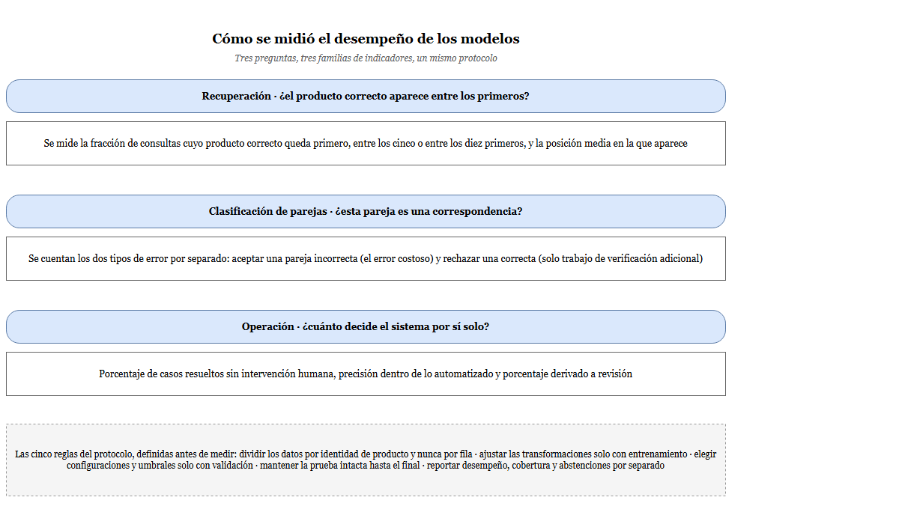
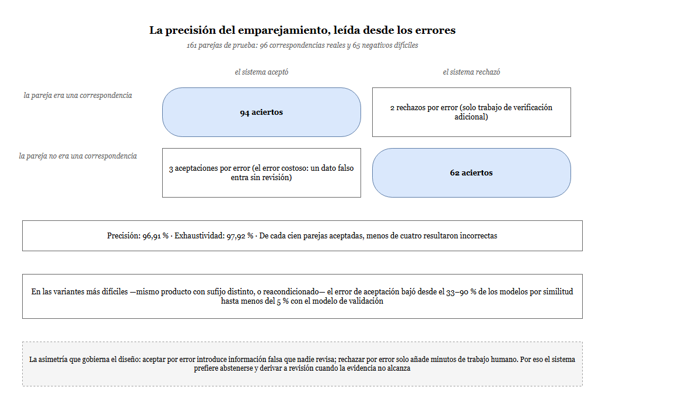
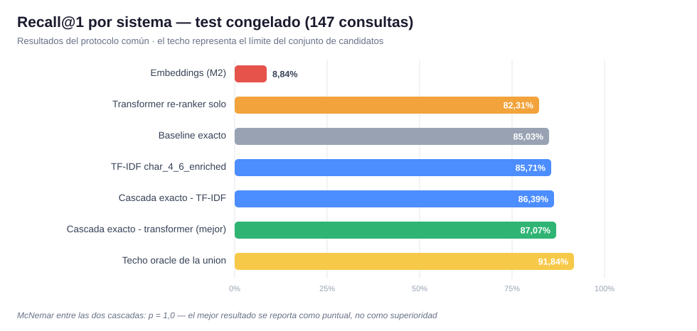
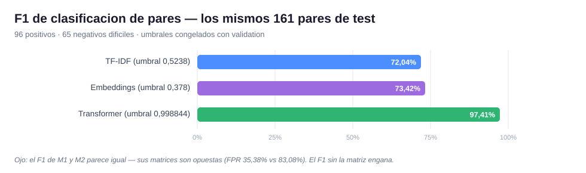
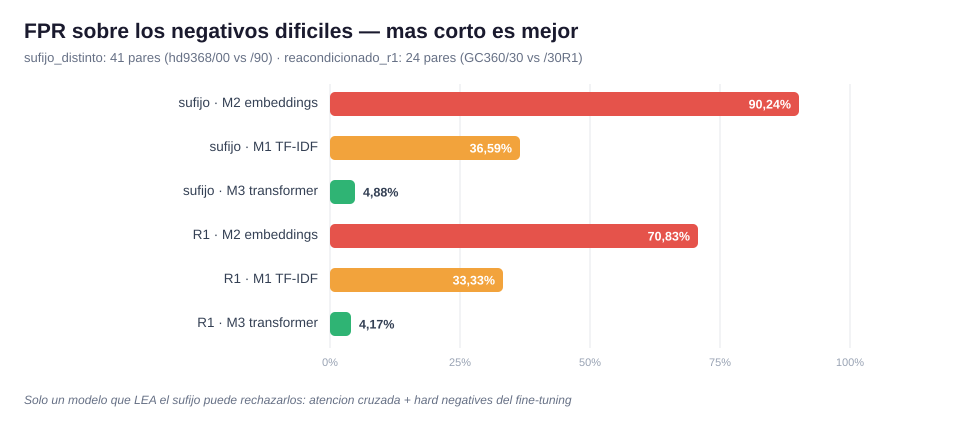
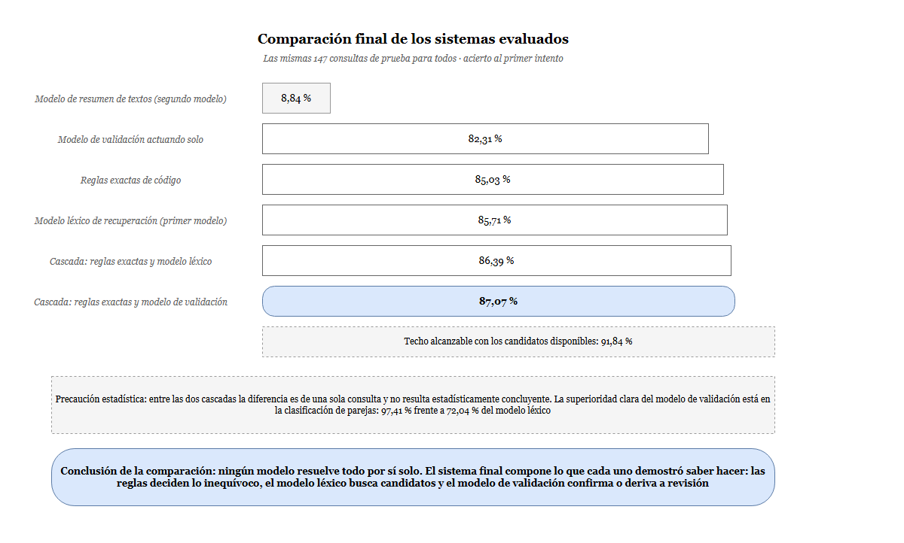

# 4.5. EVALUACIÓN DEL DESEMPEÑO TÉCNICO DE LOS MODELOS ALGORÍTMICOS MEDIANTE MÉTRICAS DE CLASIFICACIÓN

En esta sección se evaluó el desempeño de los modelos algorítmicos desarrollados para la correspondencia de productos. La evaluación se organizó en cuatro acciones: cálculo de indicadores, análisis de la precisión del *matching*, comparación bajo condiciones comunes e interpretación de los resultados. Para evitar una lectura incorrecta, se diferenciaron la recuperación de candidatos, la clasificación de pares y la operación con abstención, debido a que cada tarea respondió a una pregunta distinta.

El protocolo mantuvo separados los conjuntos de entrenamiento, validación y prueba. Las transformaciones se ajustaron con entrenamiento, las configuraciones y los umbrales se seleccionaron con validación y la prueba se utilizó una sola vez después de congelar cada modelo. La Figura 116 resume esta organización.

**Figura 116. Mapa de métricas empleadas para la evaluación técnica de los modelos**

*Fuente: elaboración propia, 2026.*

## 4.5.1. Cálculo de indicadores de desempeño de los modelos

La recuperación se evaluó sobre 147 consultas de productos retailer cuya correspondencia oficial estaba disponible en el catálogo de prueba de Ucrania. La clasificación se evaluó sobre un conjunto común de 161 pares, compuesto por 96 correspondencias y 65 negativos difíciles. Finalmente, la política operativa se examinó mediante la proporción de decisiones automáticas y casos derivados a revisión. Las unidades de evaluación se presentan en la Tabla 52.

**Tabla 52. Unidades utilizadas en la evaluación interna**

| Tarea | Unidad de análisis | Conjunto evaluado | Pregunta principal |
|---|---|---:|---|
| Recuperación y *ranking* | Consulta retailer | 147 consultas y 4.316 candidatos | ¿El producto correcto aparece entre los primeros resultados? |
| Clasificación de pares | Par retailer–catálogo | 161 pares: 96 positivos y 65 negativos | ¿El par representa el mismo producto? |
| Operación con abstención | Consulta procesada | Validación, prueba y lote operativo | ¿Qué proporción se decide automáticamente y cuál requiere revisión? |
| Comparación estadística | Consulta compartida | 147 resultados pareados | ¿La diferencia entre las dos cascadas puede distinguirse del azar? |

*Fuente: elaboración propia, 2026.*

### a) Métricas de recuperación

El Recall@K evaluó la proporción de consultas cuyo producto correcto apareció dentro de las primeras $K$ posiciones.

**Ecuación 35: Ecuación del Recall@K**

$$
\operatorname{Recall@K}=\frac{1}{N}\sum_{i=1}^{N}\mathbb{1}(r_i\leq K)
$$

*Fuente: elaboración propia, 2026.*

Como se observa en la Ecuación 35, $N$ representó el número de consultas, $r_i$ la posición del producto correcto y $\mathbb{1}$ una función indicadora. Se calcularon los cortes $K=1$, $K=5$ y $K=10$.

El rango recíproco medio (MRR) asignó mayor importancia a los resultados correctos ubicados en las primeras posiciones.

**Ecuación 36: Ecuación del rango recíproco medio**

$$
\operatorname{MRR}=\frac{1}{N}\sum_{i=1}^{N}\frac{1}{r_i}
$$

*Fuente: elaboración propia, 2026.*

Como se observa en la Ecuación 36, el MRR promedió el inverso de la posición del primer candidato correcto. Cuando la correspondencia no apareció entre los diez primeros candidatos, su contribución fue cero. Para el rango medio truncado se asignó la posición 11 a esos casos.

### b) Métricas derivadas de la matriz de confusión

La clasificación de pares se obtuvo mediante una matriz de confusión. Una correspondencia aceptada se contabilizó como verdadero positivo (TP); un par diferente rechazado, como verdadero negativo (TN); un par diferente aceptado, como falso positivo (FP); y una correspondencia real rechazada, como falso negativo (FN).

La exactitud midió la proporción total de clasificaciones correctas.

**Ecuación 37: Ecuación de la exactitud**

$$
\operatorname{Exactitud}=\frac{TP+TN}{TP+TN+FP+FN}
$$

*Fuente: elaboración propia, 2026.*

Como se observa en la Ecuación 37, la exactitud relaciona todos los aciertos con el total de pares evaluados.

La precisión evaluó la confiabilidad de las aceptaciones realizadas por el modelo.

**Ecuación 38: Ecuación de la precisión**

$$
\operatorname{Precisión}=\frac{TP}{TP+FP}
$$

*Fuente: elaboración propia, 2026.*

Como se observa en la Ecuación 38, la precisión divide los verdaderos positivos entre todas las predicciones positivas.

El *recall* o sensibilidad midió la capacidad de recuperar las correspondencias positivas reales.

**Ecuación 39: Ecuación del recall o sensibilidad**

$$
\operatorname{Recall}=\frac{TP}{TP+FN}
$$

*Fuente: elaboración propia, 2026.*

Como se observa en la Ecuación 39, el *recall* divide los verdaderos positivos entre la suma de verdaderos positivos y falsos negativos.

El F1-score integró la precisión y el *recall* mediante su media armónica.

**Ecuación 40: Ecuación del F1-score**

$$
F1=2\cdot\frac{\operatorname{Precisión}\cdot\operatorname{Recall}}
{\operatorname{Precisión}+\operatorname{Recall}}
$$

*Fuente: elaboración propia, 2026.*

Como se observa en la Ecuación 40, el F1-score disminuye cuando una de las dos métricas presenta un valor considerablemente menor que la otra.

La especificidad midió la capacidad de rechazar pares negativos.

**Ecuación 41: Ecuación de la especificidad**

$$
\operatorname{Especificidad}=\frac{TN}{TN+FP}
$$

*Fuente: elaboración propia, 2026.*

Como se observa en la Ecuación 41, la especificidad divide los verdaderos negativos entre todos los pares negativos reales.

La tasa de falsos positivos cuantificó el riesgo de aceptar productos diferentes.

**Ecuación 42: Ecuación de la tasa de falsos positivos**

$$
\operatorname{FPR}=\frac{FP}{TN+FP}
$$

*Fuente: elaboración propia, 2026.*

Como se observa en la Ecuación 42, la FPR es el complemento de la especificidad. La precisión y la FPR fueron especialmente relevantes porque un falso positivo podía incorporar una correspondencia errónea sin revisión posterior.

### c) Métricas de cobertura y ambigüedad

La cobertura automatizada midió la proporción de consultas resueltas sin intervención humana.

**Ecuación 43: Ecuación de la cobertura automatizada**

$$
\operatorname{Cobertura}=\frac{N_{\text{automático}}}{N_{\text{total}}}
$$

*Fuente: elaboración propia, 2026.*

Como se observa en la Ecuación 43, $N_{\text{automático}}$ es el número de decisiones automáticas y $N_{\text{total}}$ el total de consultas evaluadas.

La tasa de revisión representó la proporción complementaria remitida al operador.

**Ecuación 44: Ecuación de la tasa de revisión**

$$
\operatorname{TasaReview}=\frac{N_{\text{Review}}}{N_{\text{total}}}
$$

*Fuente: elaboración propia, 2026.*

Como se observa en la Ecuación 44, $N_{\text{Review}}$ es la cantidad de casos en los que el sistema se abstuvo de emitir una decisión definitiva.

El margen entre los dos primeros candidatos se utilizó como medida de ambigüedad.

**Ecuación 45: Ecuación del margen entre los dos primeros candidatos**

$$
\Delta_{1,2}=s_{(1)}-s_{(2)}
$$

*Fuente: elaboración propia, 2026.*

Como se observa en la Ecuación 45, $s_{(1)}$ y $s_{(2)}$ representan las puntuaciones del primer y segundo candidato. Un margen pequeño indicó que ambos recibieron valores similares y que la decisión era ambigua. La Tabla 53 sintetiza las métricas aplicadas. No se incluyeron Macro F1 ni F1 ponderado como resultados internos, porque la clasificación común fue binaria; estas métricas correspondieron a la evaluación multiclase externa.

**Tabla 53. Indicadores técnicos empleados en la evaluación**

| Tarea | Indicadores | Propósito |
|---|---|---|
| Recuperación | Recall@1, Recall@5, Recall@10, MRR y rango medio truncado | Medir la presencia y posición del producto correcto. |
| Clasificación de pares | Exactitud, precisión, recall, F1, especificidad y FPR | Medir la aceptación de correspondencias y el rechazo de pares incorrectos. |
| Operación | Cobertura automatizada, tasa de *Review* y margen top-1–top-2 | Cuantificar automatización y abstención ante ambigüedad. |
| Comparación | McNemar exacto e intervalo bootstrap pareado | Evaluar la incertidumbre de las diferencias entre las cascadas. |

*Fuente: elaboración propia, 2026.*

Los tres modelos generaron puntuaciones con significados y escalas diferentes. TF-IDF produjo similitud léxica, los *embeddings* produjeron similitud vectorial y el *cross-encoder* generó una puntuación aprendida para cada par. Por ello, los valores no se compararon directamente; cada modelo utilizó un umbral elegido únicamente con validación. Los puntos de corte congelados se muestran en la Tabla 54.

**Tabla 54. Umbrales de clasificación seleccionados mediante validación**

| Modelo | Puntuación | Umbral | Criterio de selección |
|---|---|---:|---|
| Modelo 1: TF-IDF | Similitud coseno | 0,5237869 | Mayor F1 en validación. |
| Modelo 2: *embeddings* | Similitud coseno | 0,3784597 | Mayor F1 en validación. |
| Modelo 3: Transformer | Salida sigmoidal del *cross-encoder* | 0,9988440 | Punto conservador seleccionado con F1 y precisión. |

*Fuente: elaboración propia, 2026.*

La clasificación binaria se obtuvo al comparar la puntuación de cada modelo con su umbral congelado.

**Ecuación 46: Regla de clasificación binaria mediante umbral**

$$
\widehat y=
\begin{cases}
1, & s(q,c)\geq\tau,\\
0, & s(q,c)<\tau
\end{cases}
$$

*Fuente: elaboración propia, 2026.*

Como se observa en la Ecuación 46, $s(q,c)$ es la puntuación asignada al par y $\tau$ el umbral del modelo. Estas puntuaciones no se interpretaron como probabilidades calibradas. En la política operativa, una evidencia insuficiente no produjo automáticamente *No Match*, sino *Review*.

## 4.5.2. Análisis de la precisión del *matching* generado

La precisión del Modelo 3 se examinó primero sobre el conjunto común de 161 pares. Con el umbral congelado, el modelo obtuvo 94 verdaderos positivos, 62 verdaderos negativos, tres falsos positivos y dos falsos negativos. La matriz se presenta en la Tabla 55.

**Tabla 55. Matriz de confusión del Modelo 3 en el conjunto común de prueba**

| Clase real | Predijo Match | Predijo No Match | Total |
|---|---:|---:|---:|
| Match | 94 | 2 | 96 |
| No Match | 3 | 62 | 65 |
| **Total** | **97** | **64** | **161** |

*Fuente: elaboración propia, 2026.*

De esta matriz se obtuvo una exactitud de 96,89 %, precisión de 96,91 %, recall de 97,92 %, F1 de 97,41 % y FPR de 4,62 %. La Figura 117 representa los aciertos y errores, así como el costo diferenciado de los falsos positivos y falsos negativos.

**Figura 117. Matriz de confusión y costo de los errores del Modelo 3**

*Fuente: elaboración propia, 2026.*

Un falso positivo aceptó productos distintos y constituyó el error de mayor riesgo para la calidad del catálogo. Un falso negativo rechazó temporalmente una correspondencia real, pero pudo recuperarse mediante revisión humana. Esta asimetría justificó una política conservadora con abstención.

La recuperación del Modelo 1 también se desagregó por cohortes. La Tabla 56 contiene todos los cortes disponibles para las 147 consultas de prueba.

**Tabla 56. Desempeño del Modelo 1 por cohorte de consulta**

| Cohorte | Consultas | Recall@1 | Recall@10 | Fuera del top-10 |
|---|---:|---:|---:|---:|
| Total | 147 | 85,71 % | 91,16 % | 13 |
| Producto visto en Ucrania | 98 | 78,57 % | 86,73 % | 13 |
| Producto no visto en Ucrania | 49 | 100,00 % | 100,00 % | 0 |
| Producto visto globalmente | 138 | 84,78 % | 90,58 % | 13 |
| Producto no visto globalmente | 9 | 100,00 % | 100,00 % | 0 |
| Par semántico visto | 15 | 100,00 % | 100,00 % | 0 |
| Par semántico nuevo | 132 | 84,09 % | 90,15 % | 13 |
| Con código visible | 143 | 88,11 % | 93,71 % | 9 |
| Sin código visible | 4 | 0,00 % | 0,00 % | 4 |
| Nombre ambiguo | 26 | 100,00 % | 100,00 % | 0 |
| Nombre no ambiguo | 121 | 82,64 % | 89,26 % | 13 |

*Fuente: elaboración propia, 2026.*

La diferencia principal se observó entre consultas con y sin código visible. Las primeras alcanzaron 88,11 % de Recall@1, mientras que las cuatro consultas sin código no recuperaron la correspondencia dentro del *top-10*. En cambio, el 100 % de la cohorte “producto no visto en Ucrania” no demostró generalización completa: 40 de sus 49 consultas correspondieron a productos vistos previamente en otros países y solo nueve fueron no vistos globalmente.

El análisis cualitativo permitió precisar la naturaleza de los errores. La Tabla 57 presenta casos representativos registrados en los archivos de resultados.

**Tabla 57. Casos representativos del análisis de errores**

| Modelo | Producto esperado | Producto seleccionado | Evidencia | Interpretación |
|---|---|---|---|---|
| TF-IDF | HD9285/00 | HD9285/93 | Similitud 0,504844 | Recuperó la familia, pero confundió el sufijo. |
| TF-IDF | SCF080/27 | SCF080/06 | Coincidencia del código base | La similitud léxica no separó la variante final. |
| Transformer | 27M2N3200S/00 | 27M2N3200A/00 | Margen 0,00000214 | Un carácter diferencial no modificó suficientemente el orden. |
| Transformer | 24B2N4200/00/RH | 24B2N4200/00 | Puntuación 0,998992 | Se omitió el sufijo adicional de la publicación. |
| Transformer | 85PUS8510/12+TAB4000/00 | 85PUS8510/12 | Puntuación 0,999038 | Se aceptó como producto individual una publicación de tipo paquete. |

*Fuente: elaboración propia, 2026.*

El archivo de errores del Modelo 3 reunió 39 observaciones: 26 selecciones top-1 incorrectas y 13 errores de clasificación obtenidos sobre el conjunto ampliado de 344 pares —nueve falsos negativos y cuatro falsos positivos—. Estas cantidades no se sumaron a la matriz de 161 pares, porque correspondieron a alcances de evaluación distintos. Los errores de ranking se concentraron en variantes cercanas y puntuaciones saturadas; el margen top-1–top-2 permitió identificar parte de esta ambigüedad antes de automatizar la decisión.

## 4.5.3. Comparación del rendimiento entre modelos

La comparación se realizó bajo un protocolo común. Los tres modelos utilizaron el mismo catálogo, las mismas particiones y las mismas cohortes de prueba. Las condiciones controladas se resumen en la Tabla 58.

**Tabla 58. Condiciones controladas para la comparación de modelos**

| Elemento | Condición aplicada |
|---|---|
| Catálogo | 4.316 productos elegibles de Philips Ucrania. |
| División temporal | Entrenamiento: enero–octubre de 2025; validación: noviembre; prueba: diciembre. |
| Prevención de fuga | Separación por identidad canónica, sin grupos compartidos entre particiones. |
| Evaluación de ranking | Las mismas 147 consultas para todos los sistemas. |
| Clasificación de pares | Los mismos 161 pares: 96 positivos y 65 negativos difíciles. |
| Selección | Configuraciones y umbrales elegidos solo con validación. |
| Uso de prueba | Una única evaluación después de congelar las decisiones. |

*Fuente: elaboración propia, 2026.*

### Comparación de recuperación

Los resultados de recuperación se presentan en la Tabla 59. El Modelo 1 obtuvo el mayor Recall@1 entre los modelos individuales, mientras que la cascada de reglas exactas y Transformer produjo el mayor resultado puntual del sistema completo.

**Tabla 59. Resultados de ranking sobre las 147 consultas de prueba**

| Sistema | Aciertos top-1 | Recall@1 | Recall@5 | Recall@10 | MRR |
|---|---:|---:|---:|---:|---:|
| Modelo 2: *embeddings* | 13/147 | 8,84 % | 20,41 % | 26,53 % | 0,1352 |
| Modelo 3: Transformer individual | 121/147 | 82,31 % | 87,76 % | 89,80 % | 0,8515 |
| Reglas exactas | 125/147 | 85,03 % | — | — | — |
| Modelo 1: TF-IDF | 126/147 | 85,71 % | 88,44 % | 91,16 % | 0,8735 |
| Reglas exactas → TF-IDF | 127/147 | 86,39 % | — | — | — |
| Reglas exactas → Transformer | 128/147 | 87,07 % | 88,44 % | 90,48 % | 0,8783 |
| Techo del conjunto de candidatos | 135/147 | 91,84 % | — | — | — |

*Fuente: elaboración propia, 2026.*

**Figura 118. Recall@1 obtenido por los sistemas de correspondencia**

*Fuente: elaboración propia, 2026.*

La unión de candidatos TF-IDF y *embeddings* contuvo la respuesta correcta para 135 consultas. Este valor, equivalente a 91,84 %, fue el límite máximo del *reranker*: ninguna reorganización podía recuperar las 12 correspondencias ausentes del conjunto de candidatos. TF-IDF aportó 134 de esas respuestas y los *embeddings* agregaron una consulta exclusiva.

La diferencia entre las dos mejores cascadas fue de una consulta. Ambas coincidieron en 144 casos y presentaron tres desacuerdos: dos a favor de la cascada con Transformer y uno a favor de la cascada con TF-IDF. La prueba exacta bilateral de McNemar se calculó mediante la siguiente expresión.

**Ecuación 47: Ecuación de la prueba exacta bilateral de McNemar**

$$
p=2\sum_{i=0}^{\min(b,c)}\binom{b+c}{i}\left(\frac{1}{2}\right)^{b+c}
$$

*Fuente: elaboración propia, 2026.*

Como se observa en la Ecuación 47, $b$ y $c$ representan los desacuerdos exclusivos a favor de cada sistema. Con $b=2$ y $c=1$, se obtuvo $p=1,0$. Por tanto, el resultado de 87,07 % se interpretó como el mejor valor puntual observado, pero no como superioridad estadística en *ranking*.

Un análisis complementario realizó 10.000 remuestras pareadas de las 147 consultas. Los intervalos de la diferencia incluyeron cero en las tres métricas, como se muestra en la Tabla 60.

**Tabla 60. Análisis bootstrap pareado entre las dos mejores cascadas**

| Métrica | Exacto → TF-IDF | Exacto → Transformer | Diferencia | IC 95 % de la diferencia | p bootstrap |
|---|---:|---:|---:|---:|---:|
| Recall@1 | 86,39 % | 87,07 % | 0,68 pp | [-1,36; 3,40] pp | 0,7842 |
| Recall@5 | 88,44 % | 88,44 % | 0,00 pp | [-2,72; 2,72] pp | 1,0000 |
| MRR | 0,8781 | 0,8783 | 0,0002 | [-0,0179; 0,0158] | 0,9304 |

*Fuente: elaboración propia, 2026.*

Los resultados de McNemar y bootstrap fueron coherentes: con esta cohorte no se demostró una diferencia concluyente de ranking entre las cascadas.

### Comparación de clasificación de pares

La clasificación sobre los mismos 161 pares produjo diferencias más amplias. La Tabla 61 compara los cuatro enfoques.

**Tabla 61. Métricas de clasificación sobre el conjunto común de pares**

| Método | Exactitud | Precisión | Recall | F1 | FPR |
|---|---:|---:|---:|---:|---:|
| Reglas exactas de código | 100,00 % | 100,00 % | 100,00 % | 100,00 % | 0,00 % |
| Modelo 1: TF-IDF | 67,70 % | 74,44 % | 69,79 % | 72,04 % | 35,38 % |
| Modelo 2: *embeddings* | 60,87 % | 61,70 % | 90,63 % | 73,42 % | 83,08 % |
| Modelo 3: Transformer | 96,89 % | 96,91 % | 97,92 % | 97,41 % | 4,62 % |

*Fuente: elaboración propia, 2026.*

El resultado perfecto de las reglas exactas no se consideró una validación independiente, porque las etiquetas del conjunto se derivaron parcialmente de la misma semántica de códigos utilizada por esas reglas. Su función fue establecer una referencia de conformidad. El resultado informativo fue que el Transformer, entrenado con pares textuales, se aproximó a esa referencia y redujo los falsos positivos.

**Figura 119. Comparación del F1 en la clasificación de pares**

*Fuente: elaboración propia, 2026.*

Los Modelos 1 y 2 alcanzaron valores próximos de F1, pero no mostraron el mismo comportamiento. El Modelo 2 obtuvo recall alto porque aceptó la mayoría de los pares; como consecuencia, su FPR llegó a 83,08 %. Esta diferencia confirmó que el F1 debía interpretarse junto con la precisión y la matriz de confusión.

Los 65 negativos difíciles se dividieron en 41 pares con sufijo distinto y 24 productos reacondicionados con indicador R1. Los resultados desagregados se presentan en la Tabla 62.

**Tabla 62. Falsos positivos por tipo de negativo difícil**

| Tipo de negativo | Pares | TF-IDF | Embeddings | Transformer |
|---|---:|---:|---:|---:|
| Sufijo distinto | 41 | 15 — 36,59 % | 37 — 90,24 % | 2 — 4,88 % |
| Reacondicionado R1 | 24 | 8 — 33,33 % | 17 — 70,83 % | 1 — 4,17 % |

*Fuente: elaboración propia, 2026.*

**Figura 120. Tasa de falsos positivos por tipo de negativo difícil**

*Fuente: elaboración propia, 2026.*

TF-IDF conservó el código base, pero el sufijo tuvo poco peso frente a la cadena compartida. Los *embeddings* aproximaron aún más las variantes de una misma familia. El Transformer redujo el FPR a menos de 5 % en ambos grupos, lo que evidenció su utilidad como validador de pares cercanos.

### Cobertura y abstención

La política del sistema emitió *Match* automático solo cuando la evidencia superó sus compuertas; en los demás casos utilizó *Review*. La Tabla 63 presenta la cobertura observada.

**Tabla 63. Cobertura y abstención de la política de decisión**

| Conjunto | Match automático | Review | No Match automático |
|---|---:|---:|---:|
| Prueba | 126 — 85,71 % | 21 — 14,29 % | 0 |
| Validación | 327 — 76,40 % | 101 — 23,60 % | 0 |
| Lote operativo MoyoUA | 80 — 20,83 % | 304 — 79,17 % | 0 |

*Fuente: elaboración propia, 2026.*

En el lote operativo solo se midió cobertura, debido a que no existió una verdad completa a nivel de consulta. Por ello, el 20,83 % no se interpretó como precisión ni como evidencia de generalización. La salida automática *No Match* permaneció deshabilitada por la misma razón: no era posible confirmar que una publicación estuviera ausente de todo el catálogo.

La Figura 121 integra la comparación de ranking, el techo de recuperación y la conclusión funcional de los modelos.

**Figura 121. Comparación final de los sistemas de correspondencia**

*Fuente: elaboración propia, 2026.*

## 4.5.4. Interpretación de los resultados experimentales

La selección de la arquitectura no se basó en una sola métrica. Las reglas exactas resolvieron coincidencias inequívocas; TF-IDF recuperó candidatos con alta eficacia cuando los títulos contenían códigos; los *embeddings* congelados no fueron competitivos como recuperador independiente, aunque añadieron una respuesta al techo del conjunto de candidatos; y el Transformer presentó el mejor desempeño como validador de pares difíciles.

La síntesis de resultados, función y límite de cada componente se presenta en la Tabla 64.

**Tabla 64. Interpretación técnica de los resultados experimentales**

| Componente | Evidencia principal | Función respaldada | Límite observado |
|---|---|---|---|
| Reglas exactas | 125/147 aciertos top-1; 0 errores al decidir | Resolver coincidencias inequívocas antes del modelado | Su evaluación de pares fue parcialmente tautológica. |
| TF-IDF | Recall@1 85,71 %; Recall@10 91,16 % | Recuperar candidatos mediante n-gramas y códigos | FPR 35,38 %; no validó bien variantes cercanas. |
| Embeddings | Recall@1 8,84 %; FPR 83,08 % | Aportar diversidad limitada al conjunto de candidatos | Diluyó diferencias de códigos y sufijos. |
| Transformer | F1 97,41 %; FPR 4,62 % | Validar pares y reorganizar candidatos difíciles | Sus puntuaciones estuvieron saturadas y el ranking individual no superó a TF-IDF. |
| Cascada exacto → Transformer | Recall@1 87,07 % | Combinar coincidencia exacta con validación aprendida | La ventaja frente a exacto → TF-IDF no fue concluyente. |
| Política Match/Review | 85,71 % de cobertura en prueba | Automatizar evidencia suficiente y abstenerse ante incertidumbre | Sin verdad query-level no se habilitó No Match automático. |

*Fuente: elaboración propia, 2026.*

Los resultados mostraron que la identidad del producto dependió principalmente de códigos, variantes y atributos técnicos. TF-IDF fue un recuperador eficaz, pero su puntuación no fue suficiente para aceptar o rechazar pares cercanos. Los *embeddings* de propósito general aportaron un resultado negativo relevante: la proximidad semántica no sustituyó la discriminación exacta de referencias. El *cross-encoder* aprendió mejor esta distinción y se consolidó como el principal validador de pares.

La ventaja demostrada del Transformer se encontró en la clasificación de pares, no en el ranking. Su F1 superó en 25,37 puntos porcentuales a TF-IDF y su FPR disminuyó de 35,38 % a 4,62 % sobre el mismo conjunto. En cambio, la mejora top-1 de la cascada fue de una consulta y no resultó concluyente según McNemar ni el análisis bootstrap.

La interpretación permaneció limitada por el alcance del experimento: se utilizó un solo catálogo nacional, el conjunto de ranking fue pequeño, las particiones no fueron completamente disjuntas por retailer y la evaluación fue retrospectiva, porque comparó consultas de 2025 con un catálogo de 2026. Además, los scores no estuvieron calibrados y el conjunto de pares difíciles midió principalmente conformidad con reglas de códigos, no generalización externa.

En consecuencia, la arquitectura final mantuvo una distribución explícita de funciones: reglas exactas para coincidencias seguras, recuperación de candidatos, Transformer para validación conjunta y *Review* para los casos ambiguos. Esta decisión conservó la intervención humana en los casos donde la evidencia interna no permitió automatizar con seguridad.
