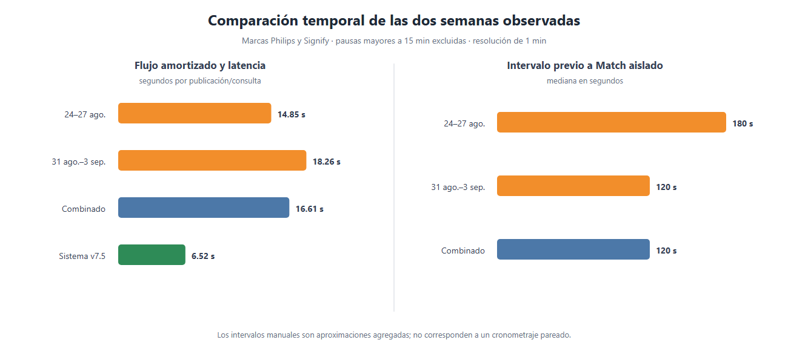
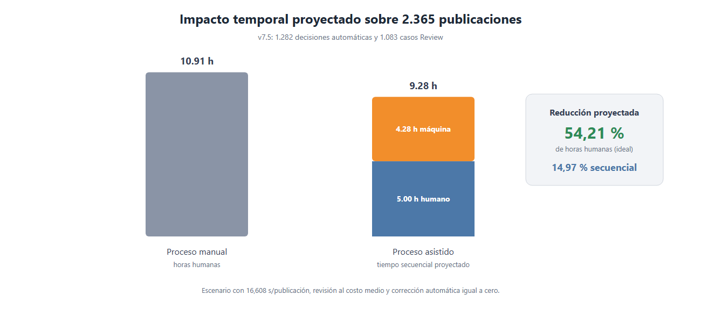
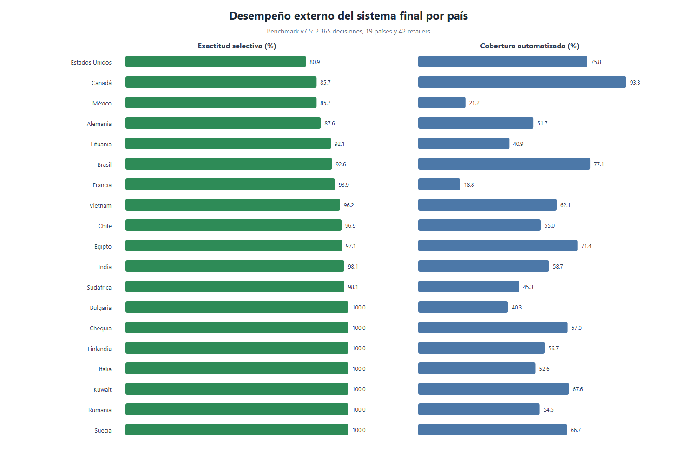

# 4.6. CONTRASTACIÓN DE LOS RESULTADOS DEL MODELO CON EL RENDIMIENTO OPERATIVO MANUAL DEL PROCESO DE VALIDACIÓN

En esta sección se contrastaron los resultados del modelo con el proceso manual para evaluar las dos afirmaciones de la hipótesis: mejorar la consistencia de la calidad del *matching* y reducir el tiempo de validación. Se utilizaron tres fuentes: la evaluación interna de 161 pares, el *benchmark* externo v7.5 de 2.365 publicaciones y dos registros semanales de actividad del Analista A.

Se diferenció el Modelo 3 del sistema final. El primero correspondió al *cross-encoder* Transformer que clasificó pares; el segundo integró reglas de negocio, coincidencia de códigos, recuperación de candidatos, el Transformer y la salida *Review*. En consecuencia, los resultados operativos se atribuyeron al sistema integrado y no únicamente al Transformer.

La Tabla 65 relaciona las variables con los instrumentos y el alcance de la evidencia.

**Tabla 65. Relación entre variables, subindicadores e instrumentos de medición**

| Variable y dimensión | Subindicador | Instrumento | Medición | Estado |
|---|---|---|---|---|
| VI: arquitectura algorítmica | Nivel de similitud calculado | Puntuaciones TF-IDF, coseno y Transformer | Puntaje y umbral por par | Cumplido |
| VI: arquitectura algorítmica | Capacidad de generalización | *Benchmark* multipaís v7.5 | Cobertura y exactitud selectiva | Parcial |
| VI: arquitectura algorítmica | Tolerancia al ruido textual | Cohortes de negativos difíciles | FPR por sufijo y reacondicionado | Cumplido técnicamente |
| VD: rendimiento predictivo | Exactitud, precisión, *recall* y F1 | Matriz de confusión | TP, TN, FP y FN | Cumplido |
| VD: estabilidad operativa | Error por ambigüedad léxica | Negativos difíciles | FPR por tipo | Cumplido técnicamente |
| VD: estabilidad operativa | Error por fatiga | Auditoría QA asociada con el momento del turno | Error por tramo de jornada | Pendiente de medición |
| VD: estabilidad operativa | Concordancia interevaluador | Dos anotaciones independientes | Kappa de Cohen | Pendiente de medición |
| VD: eficiencia temporal | Latencia algorítmica | Temporizador de la ejecución | Segundos por consulta | Cumplido |
| VD: eficiencia temporal | Tiempo manual promedio | Registros de actividad | Tiempo activo por publicación-semana | Estimado de forma agregada |
| VD: eficiencia temporal | Reducción porcentual | Escenario manual–asistido | Diferencia relativa de tiempo | Proyectado |

*Fuente: elaboración propia, 2026.*

## 4.6.1. Estimación de los tiempos del proceso manual

Los archivos semanales se analizaron con el módulo `qa_logs_tiempos.py`. La herramienta leyó los CSV mediante `pandas`, validó las columnas, verificó la integridad mediante SHA-256, ordenó las marcas temporales y agrupó las acciones por semana. Se conservaron Philips y Signify; se excluyeron 384 eventos de Duracell y PvM. No se encontraron registros de Signify B2B.

La cobertura se presenta en la Tabla 66. Aunque cada nombre de archivo abarcó de lunes a viernes, ambos fueron exportados antes de concluir el viernes y solo contuvieron cuatro días efectivos.

**Tabla 66. Cobertura de los registros semanales del proceso manual**

| Semana nominal | Periodo observado | Días | Eventos totales | Eventos Philips/Signify | Acciones de validación | Búsquedas de apoyo | Publicaciones-semana |
|---|---|---:|---:|---:|---:|---:|---:|
| 24 al 28 de agosto | 24/08 14:01–27/08 20:49 | 4 | 3.709 | 3.394 | 3.292 | 102 | 1.826 |
| 31 de agosto al 4 de septiembre | 31/08 13:02–03/09 21:16 | 4 | 3.368 | 3.299 | 3.087 | 212 | 1.942 |
| **Total** | 24/08–03/09 | **8** | **7.077** | **6.693** | **6.379** | **314** | **3.768** |

*Fuente: elaboración propia, 2026.*

La marca temporal tuvo una resolución de un minuto. Por ello, no se interpretó cada fila como un cronometraje individual. Primero se calculó el intervalo entre dos minutos consecutivos con actividad.

**Ecuación 48: Intervalo entre eventos consecutivos**

$$
\Delta_j=\tau_j-\tau_{j-1}
$$

*Fuente: elaboración propia, 2026.*

Como se observa en la Ecuación 48, $\tau_j$ es el minuto del evento actual y $\tau_{j-1}$ el del evento anterior. El valor $\Delta_j$ no representa necesariamente el tiempo de un producto individual cuando varias acciones comparten la misma marca temporal.

El tiempo activo se reconstruyó conservando únicamente intervalos positivos de hasta 15 minutos.

**Ecuación 49: Tiempo activo reconstruido**

$$
T_{\text{activo}}=\sum_j \Delta_j\,\mathbb{1}\left(0<\Delta_j\leq900\ \text{s}\right)
$$

*Fuente: elaboración propia, 2026.*

Como se observa en la Ecuación 49, $\mathbb{1}$ incluye el intervalo cuando cumple la condición y lo excluye cuando supera 900 segundos. Los intervalos mayores se trataron como pausas.

Conforme con la matriz de operacionalización, el tiempo promedio por observación se definió mediante la media aritmética.

**Ecuación 50: Tiempo promedio de validación**

$$
\overline{t}=\frac{\sum_{i=1}^{n}t_i}{n}
$$

*Fuente: elaboración propia, 2026.*

Como se observa en la Ecuación 50, $t_i$ representa el tiempo de cada observación y $n$ la cantidad total de observaciones.

Debido a que los registros no incluyeron inicio y fin por producto, se aplicó un equivalente agregado sobre la unidad publicación-semana, identificada mediante `RetailerName + RetailerProductUrl`.

**Ecuación 51: Tiempo manual promedio estimado mediante los registros semanales**

$$
\widehat{\overline{t}}_{\text{manual}}
=\frac{\sum_w T_{\text{activo},w}}{\sum_w U_w}
=\frac{27.120+35.460}{1.826+1.942}
=16{,}608\ \text{s/publicación}
$$

*Fuente: elaboración propia, 2026.*

Como se observa en la Ecuación 51, $T_{\text{activo},w}$ es el tiempo activo reconstruido de la semana $w$ y $U_w$ el número de publicaciones únicas de esa semana. Una URL repetida en otra semana se contó nuevamente porque generó una exposición operativa adicional.

La comparación semanal se muestra en la Tabla 67.

**Tabla 67. Comparación del tiempo manual entre las dos semanas observadas**

| Indicador | 24–27 de agosto | 31 de agosto–3 de septiembre | Resultado combinado |
|---|---:|---:|---:|
| Minutos distintos con actividad | 206 | 220 | 426 |
| Sesiones reconstruidas con umbral de 15 minutos | 21 | 29 | 50 |
| Tiempo activo reconstruido | 27.120 s | 35.460 s | 62.580 s |
| Publicaciones-semana | 1.826 | 1.942 | 3.768 |
| Tiempo medio amortizado | 14,852 s | 18,260 s | 16,608 s |
| Decisiones Match en un minuto exclusivo | 28 | 80 | 108 |
| Mediana del intervalo previo al Match aislado | 180 s | 120 s | 120 s |
| Media del intervalo previo al Match aislado | 160,71 s | 199,50 s | 189,44 s |

*Fuente: elaboración propia, 2026.*

**Figura 122. Comparación temporal de las dos semanas y la latencia del sistema**

*Fuente: elaboración propia, 2026.*

La segunda semana presentó un tiempo amortizado 22,94 % mayor. Esta diferencia fue descriptiva: ambas semanas correspondieron al proceso manual y tuvieron distinta composición de acciones. Con umbrales de pausa entre 5 y 30 minutos, el promedio combinado varió entre 9,554 y 23,965 segundos por publicación; por ello, el resultado principal de 16,608 segundos se informó junto con su sensibilidad.

El procesamiento fue predominantemente masivo: representó 84,77 % de los eventos de la primera semana y 81,30 % de la segunda. El caso de las 13:12 del 31 de agosto mostró 24 filas `Catalog Search` con la misma marca temporal, precedidas por una acción a las 13:02. Esos diez minutos no equivalieron a 24 tiempos individuales ni demostraron 24 clics: el evento describió un bloque de búsqueda y no una decisión final. Para aproximar la deliberación de *Match* solo se conservaron acciones `Created mapping` registradas como único evento de su minuto, con intervalo previo mayor a cero y menor o igual a 15 minutos.

En consecuencia, los 16,608 segundos describieron el flujo amortizado y los 120 segundos representaron la mediana del intervalo previo a un *Match* aislado. Ninguna de las dos cifras constituyó un cronometraje exacto por caso.

## 4.6.2. Comparación de los tiempos de procesamiento

La latencia algorítmica se calculó como el tiempo promedio requerido para procesar una consulta.

**Ecuación 52: Tiempo promedio de procesamiento algorítmico**

$$
\overline{t}_{\text{alg}}=\frac{\sum_{q=1}^{Q}t_q^{\text{alg}}}{Q}
$$

*Fuente: elaboración propia, 2026.*

Como se observa en la Ecuación 52, $t_q^{\text{alg}}$ es la duración de la consulta $q$ y $Q$ el total de consultas procesadas.

La Tabla 68 separa las ejecuciones v7 y v7.5. Esta distinción fue necesaria porque la calidad final correspondió a v7.5, mientras que la latencia de 2,87 segundos perteneció a v7.

**Tabla 68. Latencia de las ejecuciones v7 y v7.5**

| Versión | Consultas | Tiempo de decisión | Segundos por consulta | Pares evaluados por el cross-encoder | Segundos por par |
|---|---:|---:|---:|---:|---:|
| v7 | 2.365 | 6.796,6 s | 2,8738 | 5.400 | 1,2100 |
| **v7.5** | **2.365** | **15.411,8 s** | **6,5166** | **5.400** | **2,8067** |

*Fuente: elaboración propia, 2026.*

Para el contraste final se utilizó el valor conservador de v7.5.

**Ecuación 53: Latencia promedio observada en la ejecución v7.5**

$$
\overline{t}_{\text{alg}}=\frac{15.411{,}8}{2.365}=6{,}5166\ \text{s/consulta}
$$

*Fuente: elaboración propia, 2026.*

Como se observa en la Ecuación 53, los 15.411,8 segundos de ejecución se dividieron entre 2.365 consultas, obteniendo una latencia promedio de 6,5166 segundos.

La ejecución presentó un valor atípico en Makro: 353 consultas acumularon 10.194,3 segundos, equivalentes al 66,15 % del tiempo total. Sin Makro, la latencia habría sido 2,5932 segundos por consulta; este valor se conservó únicamente como análisis de sensibilidad y no sustituyó el resultado oficial.

La diferencia absoluta se calculó restando la latencia algorítmica al tiempo manual.

**Ecuación 54: Diferencia entre el tiempo manual y el algorítmico**

$$
\Delta t=\overline{t}_{\text{manual}}-\overline{t}_{\text{alg}}
$$

*Fuente: elaboración propia, 2026.*

Como se observa en la Ecuación 54, un valor positivo de $\Delta t$ indica que el procesamiento algorítmico requiere menos tiempo que la referencia manual.

La reducción relativa se expresó como porcentaje del tiempo manual.

**Ecuación 55: Reducción porcentual del tiempo**

$$
R_t=\frac{\Delta t}{\overline{t}_{\text{manual}}}\times100
$$

*Fuente: elaboración propia, 2026.*

Como se observa en la Ecuación 55, $R_t$ relaciona la diferencia temporal con la línea base manual. Este porcentaje fue descriptivo porque las dos mediciones no correspondieron a los mismos casos procesados bajo condiciones pareadas.

**Tabla 69. Comparación descriptiva entre tiempos manuales y latencia v7.5**

| Referencia manual | Tiempo manual | Latencia v7.5 | Diferencia | Reducción relativa |
|---|---:|---:|---:|---:|
| Cuota de 440 productos en 8 horas | 65,455 s | 6,517 s | 58,938 s | 90,04 % |
| Flujo amortizado de los dos registros | 16,608 s | 6,517 s | 10,092 s | 60,76 % |
| Bloque aislado de Match, mediana | 120,000 s | 6,517 s | 113,483 s | 94,57 % |

*Fuente: elaboración propia, 2026.*

Estas diferencias compararon tiempos unitarios de naturaleza distinta y no constituyeron una prueba pareada. Para representar el proceso *Human-in-the-Loop*, se incorporaron la cobertura automática y la revisión humana.

**Ecuación 56: Tiempo humano del proceso manual**

$$
T_{\text{manual}}^{H}=N\overline{t}_{\text{manual}}
$$

*Fuente: elaboración propia, 2026.*

Como se observa en la Ecuación 56, $N$ es el total de publicaciones y $\overline{t}_{\text{manual}}$ el tiempo manual promedio.

**Ecuación 57: Tiempo humano del proceso asistido**

$$
T_{\text{asistido}}^{H}=N_R\overline{t}_{R}+A\overline{t}_{C}
$$

*Fuente: elaboración propia, 2026.*

Como se observa en la Ecuación 57, $N_R=N-A$ representa los casos enviados a *Review*, $A$ las decisiones automáticas, $\overline{t}_{R}$ el tiempo promedio de revisión y $\overline{t}_{C}$ el tiempo promedio de corrección de una decisión automática.

**Ecuación 58: Tiempo secuencial del proceso asistido**

$$
T_{\text{asistido}}^{\text{secuencial}}
=N\overline{t}_{\text{alg}}+T_{\text{asistido}}^{H}
$$

*Fuente: elaboración propia, 2026.*

Como se observa en la Ecuación 58, el escenario secuencial suma el tiempo de ejecución algorítmica de todo el lote y el tiempo humano requerido por los casos no automatizados o corregidos.

Como $t_R$ y $t_C$ no fueron medidos, se construyó un escenario ideal con $t_R=16{,}608$ s y $t_C=0$. Los resultados se presentan en la Tabla 70.

**Tabla 70. Escenario temporal proyectado sobre el benchmark v7.5**

| Escenario | Casos humanos | Horas humanas | Horas de máquina | Tiempo secuencial |
|---|---:|---:|---:|---:|
| Manual | 2.365 | 10,91 h | — | 10,91 h |
| Asistido | 1.083 | 5,00 h | 4,28 h | 9,28 h |
| Diferencia | -1.282 | -5,91 h (-54,21 %) | +4,28 h | -1,63 h (-14,97 %) |

*Fuente: elaboración propia, 2026.*

**Figura 123. Impacto temporal proyectado sobre el lote de evaluación externa**

*Fuente: elaboración propia, 2026.*

La disminución de 54,21 % correspondió al máximo teórico de horas humanas liberadas si las decisiones automáticas no exigieran revisión posterior. Al sumar la ejecución del sistema como si fuera estrictamente secuencial, la reducción proyectada fue 14,97 %. Ambos resultados fueron proyecciones: los casos enviados a *Review* pueden ser más complejos que el promedio y no se midió el costo de corregir errores automáticos.

## 4.6.3. Análisis de la consistencia entre validación humana y algorítmica

### Rendimiento predictivo del Modelo 3

La evaluación binaria utilizó 161 pares: $TP=94$, $TN=62$, $FP=3$ y $FN=2$. Primero se determinó el total de observaciones.

**Ecuación 59: Total de pares de la matriz de confusión**

$$
Total=TP+TN+FP+FN=161
$$

*Fuente: elaboración propia, 2026.*

Como se observa en la Ecuación 59, el total integró las cuatro celdas de la matriz de confusión.

La exactitud se calculó mediante la proporción total de aciertos.

**Ecuación 60: Cálculo de la exactitud del Modelo 3**

$$
Exactitud=\frac{TP+TN}{Total}\times100
=\frac{94+62}{161}\times100=96{,}89\,\%
$$

*Fuente: elaboración propia, 2026.*

Como se observa en la Ecuación 60, 156 de los 161 pares fueron clasificados correctamente.

La tasa de error correspondió a la proporción de falsos positivos y falsos negativos.

**Ecuación 61: Cálculo de la tasa de error del Modelo 3**

$$
Error=\frac{FP+FN}{Total}\times100
=\frac{3+2}{161}\times100=3{,}11\,\%
$$

*Fuente: elaboración propia, 2026.*

Como se observa en la Ecuación 61, cinco de los 161 pares constituyeron errores de clasificación.

La precisión midió la proporción de correspondencias correctas entre todos los pares aceptados.

**Ecuación 62: Cálculo de la precisión del Modelo 3**

$$
Precisión=\frac{TP}{TP+FP}\times100
=\frac{94}{97}\times100=96{,}91\,\%
$$

*Fuente: elaboración propia, 2026.*

Como se observa en la Ecuación 62, 94 de las 97 aceptaciones fueron correctas.

El *recall* midió la proporción de correspondencias reales recuperadas.

**Ecuación 63: Cálculo del recall del Modelo 3**

$$
Recall=\frac{TP}{TP+FN}\times100
=\frac{94}{96}\times100=97{,}92\,\%
$$

*Fuente: elaboración propia, 2026.*

Como se observa en la Ecuación 63, el modelo recuperó 94 de las 96 correspondencias positivas reales.

El F1-score resumió el equilibrio entre precisión y *recall*.

**Ecuación 64: Cálculo del F1-score del Modelo 3**

$$
F1=2\frac{Precisión\times Recall}{Precisión+Recall}=97{,}41\,\%
$$

*Fuente: elaboración propia, 2026.*

Como se observa en la Ecuación 64, la media armónica de ambas métricas alcanzó 97,41 %.

La tasa de falsos positivos se calculó sobre los pares negativos reales.

**Ecuación 65: Cálculo de la tasa de falsos positivos del Modelo 3**

$$
FPR=\frac{FP}{FP+TN}\times100
=\frac{3}{65}\times100=4{,}62\,\%
$$

*Fuente: elaboración propia, 2026.*

Como se observa en la Ecuación 65, tres de los 65 pares negativos fueron aceptados incorrectamente. La matriz de confusión se presenta en la Tabla 55 y en la Figura 117 del apartado 4.5.2. La Tabla 71 compara estas métricas con los dos modelos de similitud directa.

**Tabla 71. Comparación del rendimiento predictivo de los modelos**

| Modelo | Exactitud | Error | Precisión | Recall | F1 | FPR |
|---|---:|---:|---:|---:|---:|---:|
| Modelo 1: TF-IDF | 67,70 % | 32,30 % | 74,44 % | 69,79 % | 72,04 % | 35,38 % |
| Modelo 2: *embeddings* | 60,87 % | 39,13 % | 61,70 % | 90,63 % | 73,42 % | 83,08 % |
| **Modelo 3: Transformer** | **96,89 %** | **3,11 %** | **96,91 %** | **97,92 %** | **97,41 %** | **4,62 %** |

*Fuente: elaboración propia, 2026.*

El Modelo 3 incrementó el F1 en 25,37 puntos porcentuales respecto de TF-IDF y redujo la FPR en 30,76 puntos. Esta evidencia demostró una mejora frente a los modelos algorítmicos base, pero no frente al operador humano, cuya tasa de error no estuvo disponible.

### Generalización y coincidencia con el operador

En v7.5, la cobertura automatizada se calculó sobre el lote completo.

**Ecuación 66: Cálculo de la cobertura automatizada externa**

$$
Cobertura=\frac{A}{N}\times100
=\frac{1.282}{2.365}\times100=54{,}21\,\%
$$

*Fuente: elaboración propia, 2026.*

Como se observa en la Ecuación 66, $A$ representa las decisiones automáticas y $N$ el total de publicaciones evaluadas.

La exactitud selectiva se calculó únicamente entre las decisiones automatizadas.

**Ecuación 67: Cálculo de la exactitud selectiva externa**

$$
Exactitud_{\text{selectiva}}=\frac{A_c}{A}\times100
=\frac{1.212}{1.282}\times100=94{,}54\,\%
$$

*Fuente: elaboración propia, 2026.*

Como se observa en la Ecuación 67, $A_c$ representa las decisiones automáticas coincidentes con el operador. Los casos *Review* no formaron parte de este denominador.

El error selectivo correspondió a los desacuerdos dentro de las decisiones automatizadas.

**Ecuación 68: Cálculo del error selectivo externo**

$$
Error_{\text{selectivo}}=\frac{A-A_c}{A}\times100
=\frac{70}{1.282}\times100=5{,}46\,\%
$$

*Fuente: elaboración propia, 2026.*

Como se observa en la Ecuación 68, 70 de las 1.282 decisiones automáticas no coincidieron con el operador.

Como medida complementaria, se calculó el peso de esos desacuerdos sobre el lote completo.

**Ecuación 69: Cálculo del error automatizado sobre el lote completo**

$$
Error_{\text{lote}}=\frac{A-A_c}{N}\times100
=\frac{70}{2.365}\times100=2{,}96\,\%
$$

*Fuente: elaboración propia, 2026.*

Como se observa en la Ecuación 69, los desacuerdos automáticos representaron 2,96 % de las 2.365 publicaciones. Este valor no fue una exactitud global del sistema, porque 1.083 consultas se remitieron a *Review*.

**Tabla 72. Resultados del sistema final en el benchmark v7.5**

| Indicador | Resultado |
|---|---:|
| Publicaciones | 2.365 |
| Países / retailers | 19 / 42 |
| Marcas | Philips y Signify |
| Decisiones automáticas | 1.282 (54,21 %) |
| Casos enviados a Review | 1.083 (45,79 %) |
| Decisiones automáticas coincidentes | 1.212 |
| Exactitud selectiva modelo–operador | 94,54 % |
| Errores entre decisiones automáticas | 70 (5,46 %) |
| Errores automáticos como proporción del lote | 2,96 % |

*Fuente: elaboración propia, 2026.*

**Figura 124. Exactitud selectiva y cobertura automatizada por país en v7.5**

*Fuente: elaboración propia, 2026.*

La exactitud selectiva expresó concordancia con un operador únicamente en los casos automatizados. Los 1.083 casos *Review* fueron abstenciones y no se contabilizaron como errores. Además, v7 y v7.5 se ajustaron tras inspeccionar este mismo *benchmark*; por ello, el resultado se consideró validación externa retrospectiva y no una prueba independiente definitiva.

La ejecución aislada de los tres modelos sobre 213 consultas *Match* produjo los resultados de la Tabla 73.

**Tabla 73. Generalización exploratoria de los modelos sobre consultas Match**

| Modelo | Consultas | Recall@1 | Recall@5 | Recall@10 | MRR |
|---|---:|---:|---:|---:|---:|
| Modelo 1: TF-IDF | 213 | 61,50 % | 86,38 % | 88,73 % | 0,7315 |
| Modelo 2: *embeddings* | 213 | 18,31 % | 33,80 % | 41,78 % | 0,2566 |
| Modelo 3: unión y *reranking* | 213 | 61,50 % | 83,57 % | 88,73 % | 0,7025 |

*Fuente: elaboración propia, 2026.*

TF-IDF y el Modelo 3 empataron en Recall@1. El intervalo *bootstrap* de la diferencia fue de -4,69 a 4,69 puntos porcentuales, con $p=1{,}0$. Por tanto, el Transformer mejoró la validación de pares, pero no superó a TF-IDF en recuperación externa top-1. La evaluación tampoco incluyó Signify B2B, por lo que la generalización al ecosistema completo quedó parcial.

### Tolerancia al ruido y ambigüedad léxica

Para un subconjunto ambiguo previamente definido, la tasa de falsos positivos se expresó de la siguiente manera.

**Ecuación 70: Tasa de falsos positivos en pares textualmente ambiguos**

$$
FPR_{amb}=\frac{FP_{amb}}{FP_{amb}+TN_{amb}}\times100
$$

*Fuente: elaboración propia, 2026.*

Como se observa en la Ecuación 70, $FP_{amb}$ representa los pares ambiguos aceptados incorrectamente y $TN_{amb}$ los pares ambiguos rechazados correctamente.

**Tabla 74. Evidencia de tolerancia al ruido textual**

| Prueba | TF-IDF | Embeddings | Modelo 3 o sistema final | Alcance |
|---|---:|---:|---:|---|
| Sufijo distinto, 41 pares | 36,59 % FPR | 90,24 % FPR | **4,88 % FPR** | Prueba interna cuantitativa |
| Reacondicionado R1, 24 pares | 33,33 % FPR | 70,83 % FPR | **4,17 % FPR** | Prueba interna cuantitativa |
| Código unido a otra palabra | — | — | 7/7 recuperados | Verificación externa de casos |
| Paquetes y combinaciones | — | — | 5 casos trasladados a Review | Ajuste conservador de v7.5 |

*Fuente: elaboración propia, 2026.*

Los resultados con sufijos y reacondicionados respaldaron la tolerancia del Modelo 3 frente a variantes cercanas. Los resultados 7/7 y los cinco casos trasladados a *Review* se interpretaron como verificaciones puntuales del sistema y no como tasas generalizables.

### Subindicadores humanos no observados

Los registros semanales incluyeron hora y acción, pero no indicaron si la decisión fue correcta. Tampoco existió una segunda anotación. En consecuencia, no fue válido deducir error por fatiga a partir de una disminución de velocidad ni calcular concordancia interevaluador.

#### a) Medición del error por fatiga operativa

Para medir este subindicador se requiere una muestra nueva con decisión adjudicada por QA. Cada registro debe contener `case_id`, `analyst_id`, decisión, resultado correcto, hora, orden dentro del turno, tiempo activo, modo de validación y nivel de complejidad. Los casos deben distribuirse aleatoriamente durante la jornada para evitar que los productos más difíciles se concentren al final.

Cada turno puede dividirse en tres bloques equivalentes de trabajo activo: inicial, medio y final. En cada bloque se calcula la tasa de error respecto de la verdad QA.

**Ecuación 71: Tasa de error por bloque de la jornada**

$$
Error_b=\frac{FP_b+FN_b}{N_b}\times100
$$

*Fuente: elaboración propia, 2026.*

Como se observa en la Ecuación 71, $FP_b$ y $FN_b$ son los errores observados en el bloque $b$ y $N_b$ el número de decisiones auditadas en ese bloque.

El cambio asociado con la fatiga se estima comparando el tramo final con el inicial.

**Ecuación 72: Variación de la tasa de error durante la jornada**

$$
\Delta Error_{fatiga}=Error_{tramo\ final}-Error_{tramo\ inicial}
$$

*Fuente: elaboración propia, 2026.*

Como se observa en la Ecuación 72, un valor positivo indica mayor error al final del turno. Para atribuir esta variación a la carga temporal se debe acompañar el resultado con un intervalo de confianza y una regresión logística que controle analista, retailer, complejidad, tipo de producto y modo de validación. La velocidad por sí sola no demuestra fatiga.

#### b) Medición de la concordancia interevaluador

Se debe seleccionar una muestra estratificada de productos y entregarla, en orden aleatorio, a por lo menos dos analistas que trabajen de forma independiente y sin conocer la respuesta del otro. La concordancia debe calcularse sobre el estado asignado y, para los casos *Match*, también sobre la igualdad exacta del `ManufacturerProductId` seleccionado.

**Ecuación 73: Ecuación del kappa de Cohen**

$$
\kappa=\frac{p_o-p_e}{1-p_e}
$$

*Fuente: elaboración propia, 2026.*

Como se observa en la Ecuación 73, $p_o$ es la proporción de acuerdo observado y $p_e$ el acuerdo esperado por azar a partir de las distribuciones marginales. El resultado debe informarse junto con el acuerdo porcentual y su intervalo de confianza. Con más de dos evaluadores corresponde utilizar kappa de Fleiss. La comparación modelo–operador no sustituye esta medición entre personas.

La Tabla 75 establece el instrumento necesario para completar la contrastación.

**Tabla 75. Herramientas e instrumentos requeridos para la prueba manual–asistida**

| Subindicador | Datos requeridos | Herramienta de software | Análisis |
|---|---|---|---|
| Tiempo manual y asistido | `case_id`, modo, inicio, fin y segundos activos | Temporizador de la interfaz y `pandas` | Diferencias pareadas e IC 95 % |
| Calidad manual y asistida | Decisión y verdad adjudicada por QA | `scikit-learn` | Exactitud, error, precisión, recall y F1 |
| Cambio de calidad | Acierto manual y asistido en los mismos casos | `statsmodels` | Prueba de McNemar |
| Reducción de tiempo | Tiempo manual y asistido por caso | `scipy` | t pareada o Wilcoxon |
| Concordancia interevaluador | Dos decisiones independientes por caso, estado y producto oficial seleccionado | `scikit-learn` | Acuerdo observado, kappa de Cohen e IC 95 % |
| Error por fatiga | Verdad QA, hora, orden, tramo, dificultad y analista | `pandas` y `statsmodels` | Error por bloque y regresión logística controlada |
| Reproducibilidad | Archivos, parámetros y resultados esperados | SHA-256 y `pytest` | Integridad y pruebas automatizadas |

*Fuente: elaboración propia, 2026.*

En un diseño pareado, cada caso debe procesarse en modo manual y asistido. La diferencia individual se calcula de la siguiente manera.

**Ecuación 74: Diferencia pareada del tiempo de validación**

$$
d_i=t_{manual,i}-t_{asistido,i}
$$

*Fuente: elaboración propia, 2026.*

Como se observa en la Ecuación 74, $d_i$ es el ahorro de tiempo del caso $i$; un valor positivo favorece el proceso asistido.

**Ecuación 75: Reducción porcentual pareada del tiempo**

$$
Reduccion_{pareada}=\frac{\sum_i d_i}{\sum_i t_{manual,i}}\times100
$$

*Fuente: elaboración propia, 2026.*

Como se observa en la Ecuación 75, la reducción compara el tiempo total ahorrado con el tiempo total manual de los mismos casos. Se considerará demostrada cuando el intervalo de confianza de la diferencia sea positivo y la prueba pareada alcance el nivel de significación definido. Los dos registros analizados no contienen la condición asistida y, por tanto, aún no permiten ejecutar esta prueba.

## 4.6.4. Determinación del impacto del modelo en el proceso de correspondencia

La Tabla 76 resume el resultado de cada subindicador y evita una aceptación global que exceda la evidencia.

**Tabla 76. Contrastación de la hipótesis mediante los subindicadores definidos**

| Subindicador | Resultado | Estado | Interpretación |
|---|---|---|---|
| Nivel de similitud calculado | Puntajes y umbral Transformer 0,998844 | Cumplido | El modelo produjo una medida reproducible por par. |
| Capacidad de generalización | 94,54 % de exactitud selectiva con 54,21 % de cobertura | Parcial | Hubo transferencia multipaís, pero el conjunto apoyó ajustes de v7.5 y no incluyó Signify B2B. |
| Tolerancia al ruido textual | FPR de 4,88 % en sufijos y 4,17 % en R1 | Cumplido técnicamente | El Modelo 3 discriminó variantes cercanas mejor que los modelos base. |
| Exactitud, precisión, recall y F1 | 96,89 %, 96,91 %, 97,92 % y 97,41 % | Cumplido | Se respaldó el rendimiento binario del Modelo 3. |
| Tasa de error algorítmica | 3,11 % en 161 pares | Cumplido | Correspondió al error interno del modelo, no al humano. |
| Error por fatiga | Protocolo definido mediante error por bloque y variación final–inicial | Pendiente de medición | Requiere verdad QA, distribución aleatoria de casos y control de dificultad según las Ecuaciones 71 y 72. |
| Concordancia interevaluador | Protocolo definido para dos decisiones independientes por caso | Pendiente de medición | Requiere al menos dos operadores sobre la misma muestra y el cálculo de kappa de Cohen de la Ecuación 73. |
| Latencia algorítmica | 6,5166 s/consulta en v7.5 | Cumplido | Se utilizó la corrida final, incluido el valor atípico. |
| Tiempo manual promedio | 16,608 s/publicación-semana; mediana de bloque Match de 120 s | Estimado | Fue una aproximación agregada con resolución de minuto. |
| Reducción porcentual | 60,76 % unitaria; 54,21 % humana ideal; 14,97 % secuencial | Proyectado | Falta una prueba pareada manual–asistida. |

*Fuente: elaboración propia, 2026.*

### Contrastación final

Para su análisis, la hipótesis se dividió en dos componentes:

- **H1a:** el modelo mejora la consistencia de la calidad del *matching*.
- **H1b:** el modelo reduce el tiempo de validación.

H1a quedó respaldada frente a los modelos algorítmicos base. El Transformer alcanzó 96,89 % de exactitud y 97,41 % de F1, además de reducir a menos de 5 % la FPR en variantes difíciles. El sistema final coincidió con el operador en 94,54 % de las decisiones automatizadas. Sin embargo, no se demostró una mejora frente a la consistencia humana porque no se dispuso de tasa de error manual, medición de fatiga ni doble anotación.

H1b quedó respaldada de forma descriptiva y proyectada. Los registros establecieron una línea base agregada de 16,608 segundos por publicación-semana y la ejecución final registró 6,5166 segundos por consulta. La cobertura de 54,21 % permitió proyectar una reducción máxima equivalente de horas humanas y una reducción secuencial de 14,97 %. No obstante, no se observó a los mismos casos en condiciones manual y asistida.

En consecuencia, la hipótesis se consideró **parcialmente corroborada**. Se demostró la mejora técnica del Modelo 3 frente a los modelos base y se obtuvo evidencia favorable de eficiencia operativa; la superioridad respecto del desempeño humano y la reducción causal del tiempo requieren completar el experimento pareado, la auditoría QA y la doble anotación definidos en la Tabla 75.
